# ssm

#### 1，CountDownLatch与CyclicBarrier的区别

(1) CountDownLatch适用于所有线程通过某一点后通知方法,而CyclicBarrier则适合让所有线程在同一点同时执行<br>
(2) CountDownLatch利用继承AQS的共享锁来进行线程的通知,利用CAS来进行--,而CyclicBarrier则利用ReentrantLock的Condition来阻塞和通知线程

```java
// 1, CountDownLatch
public class CountDownLatch {
    /**
     * Synchronization control For CountDownLatch.
     * Uses AQS state to represent count.
     */
    private static final class Sync extends AbstractQueuedSynchronizer {
        private static final long serialVersionUID = 4982264981922014374L;

        Sync(int count) {
            setState(count);
        }
        // 省略
    }
    // 省略
}

// 2, CyclicBarrier
public class CyclicBarrier {
    /**
     * Each use of the barrier is represented as a generation instance.
     * The generation changes whenever the barrier is tripped, or
     * is reset. There can be many generations associated with threads
     * using the barrier - due to the non-deterministic way the lock
     * may be allocated to waiting threads - but only one of these
     * can be active at a time (the one to which {@code count} applies)
     * and all the rest are either broken or tripped.
     * There need not be an active generation if there has been a break
     * but no subsequent reset.
     */
    private static class Generation {
        boolean broken = false;
    }

    /** The lock for guarding barrier entry */
    private final ReentrantLock lock = new ReentrantLock();

    // 省略
}
```

#### 2，jdk源码中类似的代码：

（1）HashMap中的tableSizeFor方法

```java
static final int tableSizeFor(int cap) {
    int n = cap - 1;
    n |= n >>> 1;
    n |= n >>> 2;
    n |= n >>> 4;
    n |= n >>> 8;
    n |= n >>> 16;
    return (n < 0) ? 1 : (n >= MAXIMUM_CAPACITY) ? MAXIMUM_CAPACITY : n + 1;
}

例如，参数cap为十进制的14，n就是13：
13      0000 1101

>>>1    0000 0110
|=      0000 1111
>>>2    0000 0011
|=      0000 1111    (15)
>>>4    0000 0000
|=      0000 1111    (15)
>>>8    0000 0000
|=      0000 1111    (15)

经过多次右移之后再进行 | 运算，结果是最右边四位都是1
n = 15
n + 1 = 16
```

（2）Integer中的highestOneBit方法

```java
public static int highestOneBit(int i) {
    // HD, Figure 3-1
    i |= (i >>  1);
    i |= (i >>  2);
    i |= (i >>  4);
    i |= (i >>  8);
    i |= (i >> 16);
    return i - (i >>> 1);
}
例如，i为十进制的13：
13      0000 1101
>>1     0000 0110
|=      0000 1111
>>2     0000 0011
|=      0000 1111    (15)
>>4     0000 0000
|=      0000 1111    (15)
>>8     0000 0000
|=      0000 1111    (15)
经过多次右移之后再进行 | 运算，结果是最右边四位都是1
i           0000 1111  (15)
i >>> 1     0000 0111  (7)
i - (i >>> 1) 得到
0000 1000  (8)
即15 - 7 = 8
```

#### 3，System.out.print()方法，带有synchronized锁

```java
public final static PrintStream out = null;    // System类中

// PrintStream类
public void print(String s) {
    if (s == null) {
        s = "null";
    }
    write(s);
}

// write方法带有synchronized
private void write(String s) {
    try {
        synchronized (this) {
            ensureOpen();
            textOut.write(s);
            textOut.flushBuffer();
            charOut.flushBuffer();
            if (autoFlush && (s.indexOf('\n') >= 0))
                out.flush();
        }
    }
    catch (InterruptedIOException x) {
        Thread.currentThread().interrupt();
    }
    catch (IOException x) {
        trouble = true;
    }
}
```

#### 4，java.util包中有一个Objects工具类

有equals, deepEquals, hashCode, hash, toString, compare等方法

```aidl
public static int hashCode(Object o) {
    return o != null ? o.hashCode() : 0;
}

public static int hash(Object... values) {
    return Arrays.hashCode(values);
}
```

#### 5，HashMap 1.7和1.8的区别之一

​    1.7是头插法，1.8是尾插法

#### 6，jdk中的Array类

（1）在Arrays中有使用Array.newInstance方法

```aidl
    public static <T,U> T[] copyOf(U[] original, int newLength, Class<? extends T[]> newType) {
        @SuppressWarnings("unchecked")
        T[] copy = ((Object)newType == (Object)Object[].class)
            ? (T[]) new Object[newLength]
            : (T[]) Array.newInstance(newType.getComponentType(), newLength);
        System.arraycopy(original, 0, copy, 0,
                         Math.min(original.length, newLength));
        return copy;
    }
```

（2）Array.class在反射包(java.lang.reflect)中

```aidl
    public static Object newInstance(Class<?> componentType, int length)
        throws NegativeArraySizeException {
        return newArray(componentType, length);
    }
```

#### 7，jad反编译工具

（1）下载：https://varaneckas.com/jad/  <br>
（2）解压，不需其它安装操作<br>
（3）使用：打开cmd，切换到jad所在路径，执行命令：jad  <br> D:\study\gitcode\algo\target\classes\jdk\ListArray.class  <br>
注意是.class文件，得到一个.jad文件，用记事本打开就行

```aidl
// Decompiled by Jad v1.5.8g. Copyright 2001 Pavel Kouznetsov.
// Jad home page: http://www.kpdus.com/jad.html
// Decompiler options: packimports(3) 
// Source File Name:   ListArray.java

package jdk;

import java.io.PrintStream;
import java.util.Arrays;
import java.util.List;

public class ListArray
{

    public ListArray()
    {
    }

    public static void main(String args[])
    {
        int test[] = {
            1, 2, 3, 4
        };
        // 这里入参是一个二维数组，而且是一个1行三列的二维数组，所以size为1
        List list = Arrays.asList(new int[][] {
            test
        });
        System.out.println(list.size());
        Integer test2[] = {
            Integer.valueOf(1), Integer.valueOf(2), Integer.valueOf(3), Integer.valueOf(4)
        };
        List list2 = Arrays.asList(test2);
        System.out.println(list2.size());
    }
}
```

#### 8，两个质数1231与1237

在Boolean.java中发现其hashCode方法的返回值，true返回1231，false返回1237，为什么选这两个质数？

```aidl
    public static int hashCode(boolean value) {
        return value ? 1231 : 1237;
    }
```

#### 9，死锁

（1）产生死锁必须具备以下四个条件：<br>
a. 互斥条件：该资源任意一个时刻只由一个线程占用。<br>
b. 请求与保持条件：一个进程因请求资源而阻塞时，对已获得的资源保持不放。<br>
c. 不剥夺条件:线程已获得的资源在未使用完之前不能被其他线程强行剥夺，只有自己使用完毕后才释放资源。<br>
d. 循环等待条件:若干进程之间形成一种头尾相接的循环等待资源关系。<br>

（2）为了避免死锁，我们只要破坏产生死锁的四个条件中的其中一个就可以了。现在我们来挨个分析一下：<br>
a. **破坏互斥条件** ：这个条件我们没有办法破坏，因为我们用锁本来就是想让他们互斥的（临界资源需要互斥访问）。<br>
b. **破坏请求与保持条件** ：一次性申请所有的资源。<br>
c. **破坏不剥夺条件** ：占用部分资源的线程进一步申请其他资源时，如果申请不到，可以主动释放它占有的资源。<br>
d. **破坏循环等待条件** ：依靠按序申请资源来预防。按某一顺序申请资源，释放资源则反序释放。破坏循环等待条件。<br>

#### 10，数据库

（1）三范式（Normal Form）<br>
1NF:字段不可分;<br>
2NF:有主键，非主键字段依赖主键;<br>
3NF:非主键字段不能相互依赖;<br>

解释:<br>
1NF:原子性 字段不可再分,否则就不是关系数据库;<br>
2NF:唯一性 一个表只说明一个事物;<br>
3NF:每列都与主键有直接关系，不存在传递依赖;<br>

（2）数据库还有第四、每五范式<br>
BCNF : Boyce-Codd Normal Form可以看作更好的3NF。在满足第二第三范式的情况下，决定项内部也不能部分或传递依赖。<br>
4NF：没有多值依赖<br>

（3）数据库设计涉及的名词<br>
关系：一个关系对应通常所说的一张表<br>
元组：表中的一行即为一个元组<br>
属性：表中的一列即为一个属性；每一个属性都有一个名称，称为属性名<br>
候选码：表中的某个属性组，它可以唯一确定一个元组<br>
主码：一个关系有多个候选码，选定其中一个为主码<br>
域：属性的取值范围<br>
分量：元组中的一个属性值<br>

#### 11，线程池

```java
/** 
FixedThreadPool和SingleThreadPool使用的队列是LinkedBlockingQueue,这是无界队列，允许请求的最大长度为：Integer.MAX_VALUE，
可能会堆积大量的请求，从而导致OOM
*/
public static ExecutorService newFixedThreadPool(int nThreads) {
    return new ThreadPoolExecutor(nThreads, nThreads, 
                                  0L, TimeUnit.MILLISECONDS, 
                                  new LinkedBlockingQueue<Runnable>());
}

public static ExecutorService newSingleThreadExecutor() {
    return new FinalizableDelegatedExecutorService
        (new ThreadPoolExecutor(1, 1,
                                0L, TimeUnit.MILLISECONDS,
                                new LinkedBlockingQueue<Runnable>()));
}

/**
看看LinkedBlockingQueue的容量大小：Integer.MAX_VALUE
*/
public LinkedBlockingQueue() {
    this(Integer.MAX_VALUE);
}


/**
CachedThreadPool和ScheduleThreadPool允许的创建线程数量为：Integer.MAX_VALUE，可能会创建大量的线程，从而导致OOM
*/
public static ExecutorService newCachedThreadPool() {
    return new ThreadPoolExecutor(0, Integer.MAX_VALUE,
                                      60L, TimeUnit.SECONDS,
                                      new SynchronousQueue<Runnable>());
}

public static ScheduledExecutorService newScheduledThreadPool(int corePoolSize) {
    return new ScheduledThreadPoolExecutor(corePoolSize);
}

// ScheduledThreadPoolExecutor类
public ScheduledThreadPoolExecutor(int corePoolSize) {
    super(corePoolSize, Integer.MAX_VALUE, 0, NANOSECONDS,
          new DelayedWorkQueue());
}

/**
线程池参数分析
corePoolSize : 核心线程数
maximumPoolSize : 最大线程数
keepAliveTime : 非核心线程的超时时长,如果非核心线程闲置时间超过keepAliveTime之后，就会被回收。如果设置allowCoreThreadTimeOut为true，则该参数也表示                核心线程的超时时长
unit : 超时时长单位
workQueue : 线程池中的任务队列，该队列主要用来存储已经被提交但是尚未执行的任务
handler : 拒绝策略
*/
public ThreadPoolExecutor(int corePoolSize,
        int maximumPoolSize,
        long keepAliveTime,
        TimeUnit unit,
        BlockingQueue<Runnable> workQueue,
        RejectedExecutionHandler handler)
```

#### 12，HashMap中能保证元素有序的是哪个Map？

怎么保证有序？<br>
查看源码，我们也会发现，linkedHashMap只是维护了一个链表Entry，并没有put、remove方法的具体实现。

```java
    static class Entry<K,V> extends HashMap.Node<K,V> {
        Entry<K,V> before, after;
        Entry(int hash, K key, V value, Node<K,V> next) {
            super(hash, key, value, next);
        }
    }

    private static final long serialVersionUID = 3801124242820219131L;

    /**
     * The head (eldest) of the doubly linked list.
     */
    transient LinkedHashMap.Entry<K,V> head;

    /**
     * The tail (youngest) of the doubly linked list.
     */
    transient LinkedHashMap.Entry<K,V> tail;
    /**
    The iteration ordering method for this linked hash map: true for access-order, false for insertion-order.
    true 访问顺序，false 插入顺序
    */
final boolean accessOrder;
```

添加元素要调用父类的put方法：<br>
而linkedHashMap重写了newNode方法：

```java
/**
先new一个节点，然后调用linkNodeLast，将新的节点加到链表末尾
*/
Node<K,V> newNode(int hash, K key, V value, Node<K,V> e) {
    LinkedHashMap.Entry<K,V> p =
        new LinkedHashMap.Entry<K,V>(hash, key, value, e);
    linkNodeLast(p);
    return p;
}

/**
link at the end of list
原来的尾指向p，p指向原来的尾，双向链表
*/
private void linkNodeLast(LinkedHashMap.Entry<K,V> p) {
    LinkedHashMap.Entry<K,V> last = tail;
    tail = p;
    if (last == null)
        head = p;
    else {
        p.before = last;
        last.after = p;
    }
}


/**
如果在初始化linkedHashMap对象的时候，accessOrder设为true，则表示按照访问顺序有序，在get方法中，会对访问到的元素进行处理
*/
public V get(Object key) {
    Node<K,V> e;
    if ((e = getNode(hash(key), key)) == null)
        return null;
    if (accessOrder)
        afterNodeAccess(e);
    return e.value;
}

void afterNodeAccess(Node<K,V> e) { // move node to last
    LinkedHashMap.Entry<K,V> last;
    if (accessOrder && (last = tail) != e) {
        LinkedHashMap.Entry<K,V> p =
            (LinkedHashMap.Entry<K,V>)e, b = p.before, a = p.after;
        p.after = null;
        if (b == null)
            head = a;
        else
            b.after = a;
        if (a != null)
            a.before = b;
        else
            last = b;
        if (last == null)
            head = p;
        else {
            p.before = last;
            last.after = p;
        }
        tail = p;
        ++modCount;
    }
}

// LinkedHashMap的5个构造方法
public LinkedHashMap(int initialCapacity, float loadFactor) {
    super(initialCapacity, loadFactor);
    accessOrder = false;
}

public LinkedHashMap(int initialCapacity) {
    super(initialCapacity);
    accessOrder = false;
}

public LinkedHashMap() {
    super();
    accessOrder = false;
}

public LinkedHashMap(Map<? extends K, ? extends V> m) {
    super();
    accessOrder = false;
    putMapEntries(m, false);
}

// 只有这个方法，可以由外部设定accessOrder
public LinkedHashMap(int initialCapacity,
                         float loadFactor,
                         boolean accessOrder) {
    super(initialCapacity, loadFactor);
    this.accessOrder = accessOrder;
}
```

#### 13，BeanFactory与FactoryBean

（1）BeanFactory 是接口，提供了IOC容器最基本的形式，给具体的IOC容器的实现提供了规范，功能非常复杂。<br>
（2）FactoryBean 也是接口，为IOC容器中Bean的实现提供了更加灵活的方式，FactoryBean在IOC容器的基础上给Bean的实现加上了一个简单的
工厂模式和装饰模式 ，我们可以在getObject()方法中灵活配置.<br>
如果我们想要编写一些比较复杂点儿的逻辑就会触及到其他一些不必要的接口，或者只是想简单的去构造Bean，不希望实现IOC容器原有的大量方法，这时候就可以使用FactoryBean<br>
（3）FactoryBean的实际应用<br>
a. 使用MyBatis时就用到了FactoryBean

```xml
<!-- SqlSessionFactory -->
<bean id="dgSqlSessionFactory"  class="org.mybatis.spring.SqlSessionFactoryBean">
    <property name="dataSource" ref="dgDataSource"/>
    <!-- mybatis配置文件路径-->
    <property name="configLocation"  value="classpath:mybatis-config.xml"/>   
    <!-- 实体类映射文件路径-->
    <property name="mapperLocations" value="classpath*:query-mapping/**/*.xml"/>
</bean>
```

```java
package org.mybatis.spring;

// 省略imports

public class SqlSessionFactoryBean implements FactoryBean<SqlSessionFactory>, InitializingBean, ApplicationListener<ApplicationEvent> {
    private static final Log LOGGER = LogFactory.getLog(SqlSessionFactoryBean.class);
    private Resource configLocation;
    private Resource[] mapperLocations;
    private DataSource dataSource;
    private TransactionFactory transactionFactory;
    private Properties configurationProperties;
    private SqlSessionFactoryBuilder sqlSessionFactoryBuilder = new SqlSessionFactoryBuilder();
    private SqlSessionFactory sqlSessionFactory;

    // 中间省略很多代码

    public SqlSessionFactory getObject() throws Exception {
        if (this.sqlSessionFactory == null) {
            this.afterPropertiesSet();
        }

        return this.sqlSessionFactory;
    }

    public Class<? extends SqlSessionFactory> getObjectType() {
        return this.sqlSessionFactory == null ? SqlSessionFactory.class : this.sqlSessionFactory.getClass();
    }

    public boolean isSingleton() {
        return true;
    }

}
```

    b. quartz定时器

```java
package org.springframework.scheduling.quartz;

// 省略imports

public class SchedulerFactoryBean extends SchedulerAccessor implements FactoryBean<Scheduler>, BeanNameAware, ApplicationContextAware, InitializingBean, DisposableBean, SmartLifecycle {
    public static final String PROP_THREAD_COUNT = "org.quartz.threadPool.threadCount";
    public static final int DEFAULT_THREAD_COUNT = 10;
    private static final ThreadLocal<ResourceLoader> configTimeResourceLoaderHolder = new ThreadLocal();
    private static final ThreadLocal<Executor> configTimeTaskExecutorHolder = new ThreadLocal();
    private static final ThreadLocal<DataSource> configTimeDataSourceHolder = new ThreadLocal();
    private static final ThreadLocal<DataSource> configTimeNo

    // 省略代码    

}
```

#### 14，Spring的事务传播机制

查看Spring的Propagation枚举类：

```java
// org.springframework.transaction.annotation.Propagation
public enum Propagation {

   REQUIRED(TransactionDefinition.PROPAGATION_REQUIRED),

   SUPPORTS(TransactionDefinition.PROPAGATION_SUPPORTS),

   MANDATORY(TransactionDefinition.PROPAGATION_MANDATORY),

   REQUIRES_NEW(TransactionDefinition.PROPAGATION_REQUIRES_NEW),

   NOT_SUPPORTED(TransactionDefinition.PROPAGATION_NOT_SUPPORTED),

   NEVER(TransactionDefinition.PROPAGATION_NEVER),

   NESTED(TransactionDefinition.PROPAGATION_NESTED);

   private final int value;

   Propagation(int value) {
      this.value = value;
   }

   public int value() {
      return this.value;
   }

}

// 查看org.springframework.transaction.TransactionDefinition   
int PROPAGATION_REQUIRED = 0;

int PROPAGATION_SUPPORTS = 1;

int PROPAGATION_MANDATORY = 2;

int PROPAGATION_REQUIRES_NEW = 3;

int PROPAGATION_NOT_SUPPORTED = 4;

int PROPAGATION_NEVER = 5;

int PROPAGATION_NESTED = 6;

int ISOLATION_DEFAULT = -1;

int ISOLATION_READ_UNCOMMITTED = Connection.TRANSACTION_READ_UNCOMMITTED;

int ISOLATION_READ_COMMITTED = Connection.TRANSACTION_READ_COMMITTED;

int ISOLATION_REPEATABLE_READ = Connection.TRANSACTION_REPEATABLE_READ;

int ISOLATION_SERIALIZABLE = Connection.TRANSACTION_SERIALIZABLE;

int TIMEOUT_DEFAULT = -1;

int getPropagationBehavior();

int getIsolationLevel();

int getTimeout();

boolean isReadOnly();

String getName();

// 隔离级别，java.sql.Connection
int TRANSACTION_NONE             = 0;

int TRANSACTION_READ_UNCOMMITTED = 1;

int TRANSACTION_READ_COMMITTED   = 2;

int TRANSACTION_REPEATABLE_READ  = 4;

int TRANSACTION_SERIALIZABLE     = 8;
```

#### 15，Spring事务什么时候会失效

Spring事务的原理是AOP，进行了切面增强，那么失效的根本原因就是这个AOP不起作用了。常见情况有以下几种：<br>
（1）自调用<br>
类里面使用this调用本类的方法（this通常省略），此时这个this对象不是代理类，而是对象本身<br>
解决方法有二种:<br>
a. 使用代理类调用该方法<br>
b. <aop:aspectj-autoproxy expose-proxy=“true”> ，设置expose-proxy属性为true，将代理暴露出来，使用AopContext.currentProxy()获取当前代理，将this.b()改为((UserService)AopContext.currentProxy()).b()<br>
AopContext.currentProxy()的本质是使用ThreadLocal保存代理对象

```java
public abstract class AopContext {

    /**
     * ThreadLocal holder for AOP proxy associated with this thread.
     * Will contain {@code null} unless the "exposeProxy" property on
     * the controlling proxy configuration has been set to "true".
     * @see ProxyConfig#setExposeProxy
     */
    private static final ThreadLocal<Object> currentProxy = new NamedThreadLocal<Object>("Current AOP proxy");

    public static Object currentProxy() throws IllegalStateException {
        Object proxy = currentProxy.get();
        if (proxy == null) {
            throw new IllegalStateException(
                    "Cannot find current proxy: Set 'exposeProxy' property on Advised to 'true' to make it available.");
        }
        return proxy;
    }

    static Object setCurrentProxy(Object proxy) {
        Object old = currentProxy.get();
        if (proxy != null) {
            currentProxy.set(proxy);
        }
        else {
            currentProxy.remove();
        }
        return old;
    }

}
```

（2）方法不是public<br>
@Transactional只能用于public方法上，否则事务不会生效，如果偏要用在非public方法上，可以开启AspectJ代理模式<br>
（3）数据库不支持事务<br>
（4）没有被Spring管理<br>
（5）异常被吃掉，事务不会回滚（或者抛出的异常没有被定义，默认为RuntimeException）<br>

#### 16，项目中使用dubbo的版本

大致了解一下dubbo的版本更新事件：
2012年10月23号   2.5.3
2017年9月27号     2.5.4
2018年1月8号       2.6.0    此版本合并了dubbox
2019年5月             2.7.2

阿里的dubbo最后一个版本号是2.6.10.1，之后就捐赠给了apache

apache的dubbo版本从2.7.0开始

（1）引用的jar包的版本：2.6.8
（2）xml中配置的dubbo版本号

```xml
<!-- 使用的版本号为 1.0.0，此版本号为接口的版本号 -->
<dubbo:service registry="loan" version="1.0.0" scope="remote" register="true"
               interface="com.abc.pfs.service.api.QueryService" ref="queryService"/>
```

（3）默认的协议：序列化 hessian2，传输 dubbo

```xml
<!-- 序列化协议 hessian2 -->
<dubbo:provider serialization="hessian2" retries="0"  filter="setOrg" timeout="${dubbo.provider.timeout:3000}"
                threads="${dubbo.provider.threads:300}" />
<!-- 传输协议 dubbo -->
<dubbo:protocol name="dubbo" port="${dubbo.protocol.port}" />
```

#### 17，单例模式，为什么枚举型单例是安全的？

因为反射包下的Constructor中的newInstance方法，不允许通过反射获取枚举的实例

```java
// java.lang.reflect.Constructor
public T newInstance(Object ... initargs)
        throws InstantiationException, IllegalAccessException,
               IllegalArgumentException, InvocationTargetException
{
   if (!override) {
     if (!Reflection.quickCheckMemberAccess(clazz, modifiers)) {
        Class<?> caller = Reflection.getCallerClass();
        checkAccess(caller, clazz, null, modifiers);
     }
   }
   // 如果是ENUM，抛出异常
   if ((clazz.getModifiers() & Modifier.ENUM) != 0)
      throw new IllegalArgumentException("Cannot reflectively create enum objects");
   ConstructorAccessor ca = constructorAccessor;   // read volatile
   if (ca == null) {
     ca = acquireConstructorAccessor();
   }
   @SuppressWarnings("unchecked")
   T inst = (T) ca.newInstance(initargs);
     return inst;
}
```

#### 18，Dubbo SPI

（1）与Java SPI相比，Dubbo SPI做了一定的改进和优化<br>
a. JDK标准的SPI会一次性实例化扩展点所有实现，如果有扩展实现则初始化很耗时，如果没有用上也加载，则浪费资源<br>
b. 如果扩展加载失败，则连扩展的名称都获取不到了，加载失败的真正原因被“吃掉”了，报的错并不是真正失败的原因<br>
c. 增加了对扩展IOC和AOP的支持，一个扩展可以直接setter注入其他扩展。在Java SPI使用中，java.util.ServiceLoader
会一次把某接口下的所有实现庆全部初始化，用户直接调用即可。 Dubbo SPI只是加载配置文件中的类，并分成不同的种类缓存在内存中，而不会立即全部初始化，在性能上有更好的表现。

```java
// IOC


// AOP

```


（2）ExtensionLoader的工作原理

ExtensionLoader的逻辑入口可以分为：<br>
a. getExtension  获取普通扩展类<br>
b. getAdaptiveExtension  获取自适应扩展类<br>
c. getActivateExtension  获取自动激活的扩展类<br>

（3）扩展点动态编译的实现

Dubbo中有三种代码编译器：JdkCompiler、JavassitCompiler和AdaptiveCompiler

```java
/**
注解的默认值是javassist，即Javassist编译器将作为默认编译器。
如果用户想改变默认编译器，则可以通过<dubbo:application compiler="jdk" />标签进行配置
*/
@SPI("javassist")
public interface Compiler {
    Class<?> compile(String code, ClassLoader classLoader);
}
```

a. JdkCompiler使用了JDK自带的编译器

```java
import javax.tools.DiagnosticCollector;
import javax.tools.FileObject;
import javax.tools.ForwardingJavaFileManager;
import javax.tools.JavaCompiler;
import javax.tools.JavaFileManager;
import javax.tools.JavaFileObject;
import javax.tools.SimpleJavaFileObject;
import javax.tools.StandardJavaFileManager;
import javax.tools.StandardLocation;
import javax.tools.ToolProvider;
import javax.tools.JavaFileManager.Location;
import javax.tools.JavaFileObject.Kind;
public class JdkCompiler extends AbstractCompiler {.......}
```

b. Javassist编译器

```java
public class JavassitCompiler extends AbstractCompiler {.......}
```

c. Adaptive编译器

```java
/**
AdaptiveCompiler直接实现Compiler，没有继承AbstractCompiler
注解@Adaptive，说明AdaptiveCompiler会固定为默认实现，这个Compiler的主要作用就是为了管理其他compiler
*/
@Adaptive
public class AdaptiveCompiler implements Compiler {
    private static volatile String DEFAULT_COMPILER;

    public AdaptiveCompiler() {
    }

    // 设置默认的编译器名称
    public static void setDefaultCompiler(String compiler) {
        DEFAULT_COMPILER = compiler;
    }

    // 通过ExtensionLoader获取对应的编译器扩展类实现，并调用真正的compiler做编译
    public Class<?> compile(String code, ClassLoader classLoader) {
        ExtensionLoader<Compiler> loader = ExtensionLoader.getExtensionLoader(Compiler.class);
        String name = DEFAULT_COMPILER;
        Compiler compiler;
        if (name != null && name.length() > 0) {
            compiler = (Compiler)loader.getExtension(name);
        } else {
            compiler = (Compiler)loader.getDefaultExtension();
        }

        return compiler.compile(code, classLoader);
    }
}
```

#### 19，什么是MVCC

（1）MVCC是Muiti-Version Concurrency Control的简写，即多版本并发控制：读取数据时通过一种类似快照的方式将数据保存下来，这样读锁和写锁就不冲突了，不同的事务session会看到自己特定版本的数据，版本链<br>
MVCC只有在READ COMMITTED和REPEATABLE READ两个隔离级别下工作。其他两个隔离级别和MVCC不兼容，因为READ UNCOMMITTED总是读取最新的数据行，而不是符合当前事务版本的数据行。而SERIALIZABLE则会对所有读取的行都加锁。<br>
a. 快照读  select 语句<br>
b. 当前读  select ... lock in share mode<br>
        select ... for update<br>
        insert/update/delete<br>
（2）聚簇索引记录中有两个必要的隐藏列：<br>
a. trx_id  用来存储每次对某条聚簇索引记录进行修改时候的事务id<br>
b. roll_pointer  每次对哪条聚簇索引记录有修改的时候，都会把老版本写入undo日志中。这个roll_pointer就是存了一个指针，
它指向这条聚簇索引记录的上一个版本的位置，通过它来获得上一个版本的记录信息（注意插入操作的undo日志没有这个属性，因为它没有老版本）<br>

（3）READ COMMITTED和REPEATABLE READ的区别就在于它们生成READVIEW的策略不同：<br>
a. READ COMMITTED隔离级别下的事务在每次查询的开始都会生成一个独立的READVIEW<br>
b. REPEATABLE READ隔离级别则在第一次读的时候生成一个READVIEW，之后的读都复用之前的READ VIEW<br>

（4）开启事务时创建readview,readview维护当前活动的事务id，即未提交的事务id，排序生成一个数组
访问数据，获取数据中的事务id（获取的是事务id最大的记录），对比readview:<br>
a. 如果在readview的左边（比readview小），可以访问（在左边意味着该事务已经提交）<br>
b. 如果在readview的右边（比readview大），或者在readview区间内，不可以访问，获取roll_pointer，取上一版本重新对比（在右边意味着，该事务在readview生成之后出现；在readview区间内意味着该事务还未提交）<br>

#### 20，mysql主从同步原理

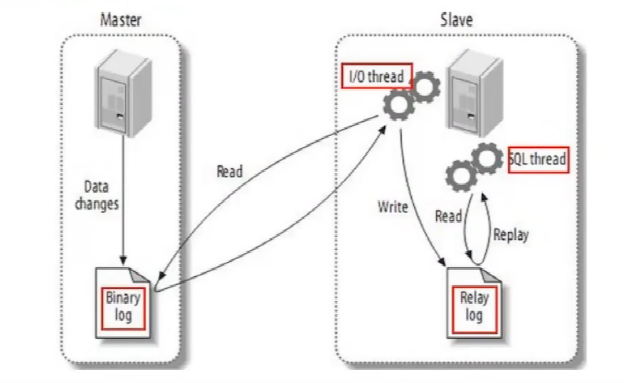
（1）有三个线程：binlog dump thread（master）、I/O thread（slave）和sql thread（slave）<br>

（2）过程：<br>
a. 主节点binlog，主从复制的基础是主库记录数据库的所有变更记录到binlog。binlog在数据库服务器启动那一刻起，保存所有修改数据库结构或内容的一个文件<br>
b. 主节点log dump线程：当log有变动时，log dump线程读取其内容并发送给从节点<br>
c. 从节点I/O线程接收binlog内容，并将其写入到relay log文件中<br>
d. 从节点sql线程读取relay log文件内容，对数据更新进行同步，最终保证主从数据库的一致性<br>

（3）同步方式<br>
a. 异步复制：mysql默认的复制方式<br>
b. 全同步复制：主库强制同步日志到从库，所有的从库都执行完成后才返回给客户端，此方式性能不高<br>
c. 半同步复制：从库写入日志成功后返回ACK确认给主库，主库收到至少一个从库的确认就认为同步操作完成<br>

（4）MTS<br>
    MySQL的复制延迟是一直被诟病的问题之一，在MySQL 5.7版本已经支持“真正”的并行复制功能，官方称为为enhanced multi-threaded slave（简称MTS），因此复制延迟问题已经得到了极大的改进。<br>
参考：http://blog.sina.com.cn/s/blog_53b13d950102yiyn.html
https://www.cnblogs.com/quzq/p/13221498.html

```text
从库多线程MTS
基本要求:
5.7以上的版本
必须开启GTID
binlog必须是row模式

gtid_mode=ON<br>
enforce_gtid_consistency=ON<br>
log_slave_updates=ON　　　　　　　　　　# 前3行为开启gtid模式
slave-parallel-type=LOGICAL_CLOCK　　# 关键参数, 支持事务级别的sql进行并发回放, 默认是database级别(也就是只能并发database)
slave-parallel-workers=16　　　　　　　# 并发回访的线程数, cpu数的一半
master_info_repository=TABLE
relay_log_info_repository=TABLE
relay_log_recovery=ON
```

#### 21，Spring循环依赖

spring内部有三级缓存：<br>
（1）singletonObjects 一级缓存，用于保存实例化、注入、初始化完成的bean实例<br>
（2）earlySingletonObjects 二级缓存，用于保存实例化完成的bean实例<br>
（3）singletonFactories 三级缓存，用于保存bean创建工厂，以便于后面扩展有机会创建代理对象。<br>

摘自博客：[spring: 我是如何解决循环依赖的？ - Mars独行侠 - 博客园 (cnblogs.com)](https://www.cnblogs.com/wjxzs/p/14239052.html)

#### 22，Spring中的DependsOn注解

AbstractBeanFactory中DependsOn相关代码：

```java
try {
    RootBeanDefinition mbd = this.getMergedLocalBeanDefinition(beanName);
    this.checkMergedBeanDefinition(mbd, beanName, args);
    String[] dependsOn = mbd.getDependsOn();
    String[] var11;
    if (dependsOn != null) {
        var11 = dependsOn;
        int var12 = dependsOn.length;

        for(int var13 = 0; var13 < var12; ++var13) {
            String dep = var11[var13];
            if (this.isDependent(beanName, dep)) {
                throw new BeanCreationException(mbd.getResourceDescription(), beanName, "Circular depends-on relationship between '" + beanName + "' and '" + dep + "'");
            }

            this.registerDependentBean(dep, beanName);

            try {
                this.getBean(dep);
            } catch (NoSuchBeanDefinitionException var24) {
                throw new BeanCreationException(mbd.getResourceDescription(), beanName, "'" + beanName + "' depends on missing bean '" + dep + "'", var24);
            }
        }
    }
 // 省略代码   
}
```

#### 23，HashMap中转化为红黑树的阈值为什么是8，退化的阈值为什么是6？

```java
public class HashMap<K,V> extends AbstractMap<K,V>
    implements Map<K,V>, Cloneable, Serializable {

    private static final long serialVersionUID = 362498820763181265L;

    /*
        * Because TreeNodes are about twice the size of regular nodes, we
        * use them only when bins contain enough nodes to warrant use
        * (see TREEIFY_THRESHOLD). And when they become too small (due to
        * removal or resizing) they are converted back to plain bins.  In
        * usages with well-distributed user hashCodes, tree bins are
        * rarely used.  Ideally, under random hashCodes, the frequency of
        * nodes in bins follows a Poisson distribution
        * (http://en.wikipedia.org/wiki/Poisson_distribution) with a
        * parameter of about 0.5 on average for the default resizing
        * threshold of 0.75, although with a large variance because of
        * resizing granularity. Ignoring variance, the expected
        * occurrences of list size k are (exp(-0.5) * pow(0.5, k) /
        * factorial(k)). The first values are:
        *
        * 0:    0.60653066
        * 1:    0.30326533
        * 2:    0.07581633
        * 3:    0.01263606
        * 4:    0.00157952
        * 5:    0.00015795
        * 6:    0.00001316
        * 7:    0.00000094
        * 8:    0.00000006
        * more: less than 1 in ten million


        ......
        */
    /**
    在理想情况下,使用随机哈希码,节点出现的频率在hash桶中遵循泊松分布，同时给出了桶中元素个数和概率的对照表。
    从上面的表中可以看到当桶中元素到达8个的时候，概率已经变得非常小，也就是说用0.75作为加载因子，每个碰撞位置的链表长度超过８个是几乎不可能的。
    */
    static final int TREEIFY_THRESHOLD = 8;

    static final int UNTREEIFY_THRESHOLD = 6;
```

#### 24，Spring如何解决循环依赖？

##### 获取Bean

```java
// AbstractBeanFactory.doGetBean
protected <T> T doGetBean(String name, @Nullable Class<T> requiredType, @Nullable Object[] args, boolean typeCheckOnly) throws BeansException {
        String beanName = this.transformedBeanName(name);
        Object sharedInstance = this.getSingleton(beanName);
        Object bean;
        if (sharedInstance != null && args == null) {
            if (this.logger.isTraceEnabled()) {
                if (this.isSingletonCurrentlyInCreation(beanName)) {
                    this.logger.trace("Returning eagerly cached instance of singleton bean '" + beanName + "' that is not fully initialized yet - a consequence of a circular reference");
                } else {
                    this.logger.trace("Returning cached instance of singleton bean '" + beanName + "'");
                }
            }

            bean = this.getObjectForBeanInstance(sharedInstance, name, beanName, (RootBeanDefinition)null);
        } else {
            // 省略
        }
}
```

##### 第一次查询

```java
// DefaultSingletonBeanRegistry.getSingleton
@Nullable
public Object getSingleton(String beanName) {
    return this.getSingleton(beanName, true);
}

@Nullable
protected Object getSingleton(String beanName, boolean allowEarlyReference) {
    Object singletonObject = this.singletonObjects.get(beanName);
    if (singletonObject == null && this.isSingletonCurrentlyInCreation(beanName)) {
        singletonObject = this.earlySingletonObjects.get(beanName);
        if (singletonObject == null && allowEarlyReference) {
            synchronized(this.singletonObjects) {
                singletonObject = this.singletonObjects.get(beanName);
                if (singletonObject == null) {
                    singletonObject = this.earlySingletonObjects.get(beanName);
                    if (singletonObject == null) {
                        ObjectFactory<?> singletonFactory = (ObjectFactory)this.singletonFactories.get(beanName);
                        if (singletonFactory != null) {
                            singletonObject = singletonFactory.getObject();
                            this.earlySingletonObjects.put(beanName, singletonObject);
                            this.singletonFactories.remove(beanName);
                        }
                    }
                }
            }
        }
    }

    return singletonObject;
}
```

##### 开始创建

```java
// AbstractAutowireCapableBeanFactory.doCreateBean
protected Object doCreateBean(String beanName, RootBeanDefinition mbd, @Nullable Object[] args) throws BeanCreationException {
        BeanWrapper instanceWrapper = null;
        if (mbd.isSingleton()) {
            instanceWrapper = (BeanWrapper)this.factoryBeanInstanceCache.remove(beanName);
        }

        if (instanceWrapper == null) {
            instanceWrapper = this.createBeanInstance(beanName, mbd, args);
        }

        Object bean = instanceWrapper.getWrappedInstance();
        Class<?> beanType = instanceWrapper.getWrappedClass();
        if (beanType != NullBean.class) {
            mbd.resolvedTargetType = beanType;
        }

        synchronized(mbd.postProcessingLock) {
            // 省略代码
        }
}

// 创建实例
        createBeanInstance

// 填充属性
        populateBean

// 初始化
        initializeBean

// 填充 beanName
        invokeAwareMethods
// 前置处理
        applyBeanPostProcessorsBeforeInitialization

// 初始化方法
        invokeInitMethods

// 后置处理（AOP动态代理）
        applyBeanPostProcessorsAfterInitialization

// AOP处理
//# 后置处理  触发动态代理
        AbstractAutoProxyCreator.postProcessAfterInitialization

// 创建动态代理
        AbstractAutoProxyCreator.createProxy

// 解决循环依赖：提前引用
// 提前引用
        getEarlyBeanReference()
// 创建代理
        createProxy
```

#### 25，Spring的依赖注入（DI）

##### Constructor-based Dependency Injection

Constructor-based DI is accomplished by the container invoking a constructor with a number of arguments, each representing a dependency. Calling a static factory method with specific arguments to construct the bean is nearly equivalent, and this discussion treats arguments to a constructor and to a static factory method similarly.

##### Setter-based Dependency Injection

Setter-based DI is accomplished by the container calling setter methods on your beans after invoking a no-argument constructor or a no-argument static factory method to instantiate your bean.

基于Setter的DI是由容器在调用无参数构造函数或无参数`静态`工厂方法实例化bean后调用bean上的Setter方法来实现的。

##### Constructor-based or setter-based DI?

Since you can mix constructor-based and setter-based DI, it is a good rule of thumb to use constructors for mandatory dependencies and setter methods or configuration methods for optional dependencies. Note that use of the @Required annotation on a setter method can be used to make the property be a required dependency; however, constructor injection with programmatic validation of arguments is preferable.

The Spring team generally advocates constructor injection, as it lets you implement application components as immutable objects and ensures that required dependencies are not null. Furthermore, constructor-injected components are always returned to the client (calling) code in a fully initialized state. As a side note, a large number of constructor arguments is a bad code smell, implying that the class likely has too many responsibilities and should be refactored to better address proper separation of concerns.

Setter injection should primarily only be used for optional dependencies that can be assigned reasonable default values within the class. Otherwise, not-null checks must be performed everywhere the code uses the dependency. One benefit of setter injection is that setter methods make objects of that class amenable to reconfiguration or re-injection later. Management through JMX MBeans is therefore a compelling use case for setter injection.

Use the DI style that makes the most sense for a particular class. Sometimes, when dealing with third-party classes for which you do not have the source, the choice is made for you. For example, if a third-party class does not expose

#### 26，双亲委派模型

（1）三层类加载器<br>
a. 启动类加载器（Bootstrap Class Loader）：<br>
无父类加载器<br>
加载范围：存放在<JAVA_HOME>\lib目录，或者被-Xbootclasspath参数所指定的路径中存放的，而且是Java虚拟机能够识别的类库<br>
b. 扩展类加载器（Extension Class Loader）：<br>
父类加载器就是Bootstrap Class Loader<br>
加载范围：存放在<JAVA_HOME>\lib\ext目录，或者被java.ext.dirs系统变量所指定的路径中所有的类库<br>
c. 应用程序类加载器（Application Class Loader）：<br>
父类加载器就是Extension Class Loader<br>
加载范围：用户类路径（ClassPath）上所有的类库<br>

（2）工作过程<br>
如果一个类加载器收到了类加载的请求，它首先不会自己去尝试加载这个类，而是把这个请求委派给父类加载器去完成，每一个层次的类加载器都是如此，因此所有的加载请求最终都应该传送到最顶层的启动类加载器中，只有当父加载器反馈自己无法完成这个加载请求（它的搜索范围中没有找到所需要的类）时，子加载器才会尝试自己去完成加载<br>
（3）破坏双亲委派模型<br>
a. JDK1.2以前<br>
双亲委派模型是JDK1.2之后才引入的，已有的代码有很多重写ClassLoader中的loadClass()方法，而双亲委派的具体逻辑就在这个loadClass()方法里，所以Java设计者们引入双亲委派模型时不得不做出一些妥协，为了兼容这些已有代码，无法再以技术手段避免loadClass()被子类覆盖的可能性，只能在JDK1.2之后的java.lang.ClassLoader中添加一个新的protected方法findClass()，并引导用户编写的类加载逻辑时尽可能去重写这个方法，而不是在loadClass()中编写代码。

```java
protected Class<?> loadClass(String name, boolean resolve) throws ClassNotFoundException {
    synchronized (getClassLoadingLock(name)) {
        // First, check if the class has already been loaded
        Class<?> c = findLoadedClass(name);
        if (c == null) {
            long t0 = System.nanoTime();
            try {
                if (parent != null) {
                    c = parent.loadClass(name, false);
                } else {
                    c = findBootstrapClassOrNull(name);
                }
            } catch (ClassNotFoundException e) {
            // ClassNotFoundException thrown if class not found
            // from the non-null parent class loader
            }

            if (c == null) {
                // If still not found, then invoke findClass in order
                // to find the class.
                long t1 = System.nanoTime();
                c = findClass(name);

            // this is the defining class loader; record the stats
            sun.misc.PerfCounter.getParentDelegationTime().addTime(t1 - t0);
            sun.misc.PerfCounter.getFindClassTime().addElapsedTimeFrom(t1);
            sun.misc.PerfCounter.getFindClasses().increment();
            }
        }
        if (resolve) {
            resolveClass(c);
        }
        return c;
    }
}
/**
Finds the class with the specified binary name. This method should be overridden by class loader implementations that follow the delegation model for loading classes, and will be invoked by the loadClass method after checking the parent class loader for the requested class. The default implementation throws a ClassNotFoundException.
Params: name – The binary name of the class
Returns: The resulting Class object
Throws: ClassNotFoundException – If the class could not be found
Since: 1.2
*/
protected Class<?> findClass(String name) throws ClassNotFoundException {
        throw new ClassNotFoundException(name);
    }
```

b. Java SPI服务<br>
比如JNDI、JDBC等的实现类是由不同厂商实现并部署在应该程序的ClassPath下的。解决方法：引入线程上下文类加载器（Thread Context ClassLoader）。这个类加载器可以通过java.lang.Thread类的setContextClassLoader()方法进行设置，如果创建线程时还未设置，它将会从父线程中继承一个，如果在应用程序的全局范围内都没有设置过的话，那这个类加载器默认就是应用程序类加载器。

```java
// since 1.2
public void setContextClassLoader(ClassLoader cl) {
    SecurityManager sm = System.getSecurityManager();
    if (sm != null) {
        sm.checkPermission(new RuntimePermission("setContextClassLoader"));
    }
    contextClassLoader = cl;
}
```

缺点：当SPI的服务提供者多于一个的时候，代码就只能根据具体提供者的类型来硬编码判断，为了解决这个问题，JDK 6提供了java.util.ServiceLoader类，以META-INF/services中的配置信息，辅以责任链模式，才给SPI的加载提供了一个相对合理的解决方案

```java
// since 1.6
public final class ServiceLoader<S>
    implements Iterable<S>
{
    // 省略其他

    public static <S> ServiceLoader<S> load(Class<S> service) {
        ClassLoader cl = Thread.currentThread().getContextClassLoader();
        return ServiceLoader.load(service, cl);
    }

    public static <S> ServiceLoader<S> loadInstalled(Class<S> service) {
        ClassLoader cl = ClassLoader.getSystemClassLoader();
        ClassLoader prev = null;
        while (cl != null) {
            prev = cl;
            cl = cl.getParent();
        }
        return ServiceLoader.load(service, prev);
    }

    // 省略其他

}
```

c. 用户对程序动态性的追求，OSGi实现模块化热部署，它自定义的类加载器机制

#### 27，轻量级锁

工作过程：在代码即将进入同步块的时候，如果此同步对象没有被锁定（锁标志位为“01”状态），虚拟机首先将在当前线程的栈帧中建立一个名为锁记录（Lock Record）的空间，用于存储对象目前的mark word的拷贝（Displaced Mark Word）。

然后虚拟机将使用CAS操作尝试把对象的Mark Word更新为指向Lock Record的指针。

（1）如果这个更新动作成功了，即代表该线程拥有了这个对象的锁，并且对象Mark Word的锁标志位将转变了“00”，表示此对象处于轻量级锁定状态。

（2）如果更新失败，那就意味着至少存在一条线程与当前线程竞争获取该对象的锁。虚拟机首先会检查对象的Mark Word是否指向当前线程的栈帧，如果是，说明当前线程已经拥有了这个对象的锁，那直接进入同步块继续执行就可以了，否则说明这个锁对象已经被其他线程抢占了。如果出现2条以上的线程争用同一个锁的情况，那轻量级锁就不再有效，必须膨胀为重量级锁，锁标志的状态值变为“10”

#### 28，AtomicInteger 线程安全原理

```java
public class AtomicInteger extends Number implements java.io.Serializable {
    private static final long serialVersionUID = 6214790243416807050L;

    // setup to use Unsafe.compareAndSwapInt for updates
    private static final Unsafe unsafe = Unsafe.getUnsafe();
    private static final long valueOffset;

    static {
        try {
            // 拿到“原来的值”的内存地址
            valueOffset = unsafe.objectFieldOffset
                (AtomicInteger.class.getDeclaredField("value"));
        } catch (Exception ex) { throw new Error(ex); }
    }

    // 省略代码

    // CAS
    public final boolean compareAndSet(int expect, int update) {
        return unsafe.compareAndSwapInt(this, valueOffset, expect, update);
    }

    // 省略代码

}
```

#### 29，docker的优势

原文链接：https://blog.csdn.net/qq_37527715/article/details/79878891
（1）简化配置
这是Docker初始目的，虚拟机VM最大的好处是基于你的应用配置能够无缝运行在任何平台上。Docker提供同样类似VM的能力，但是没有任何副作用，它能让你将环境和配置放入代码然后部署，同样的Docker配置能够在各种环境中使用，这实际是将应用环境和底层环境实现了解耦。

（2）代码管道化管理
能够对代码以流式pipeline管道化进行管理，从开发者的机器到生产环境机器这个流程中都能有效管理。因为在这个流程中会有各种不同的环境，每个都可能有微小的区别，Docker提供了跨越这些异构环境以一致性的微环境，从开发到部署实现流畅发布。

（3）开发人员的生产化
在一个开发环境，我们希望我们的开发环境能更加接近于生产环境，我们会让每个服务运行在自己的VM中，这样能模拟生产环境，比如有时我们并不总是需要跨越网络连接，这样我们可以将多个Docker装载一系列服务运行在单机上最大程度模拟生产分布式部署的环境。

（4）应用隔离
有很多理由你需要在一台机器上运行多个应用，这就需要将原来铁板一块monolithic的应用切分为很多微服务。实现应用之间的解耦，将多个应用服务部署在多个Docker中能轻松达到这个目的。

（5）服务合并
使用Docker也能合并多个服务以降低费用，不多的操作系统内存占用，跨实例共享多个空闲的内存，这些技术Docker能以更加紧密资源提供更有效的服务合并。

（6）多租户
Docker能够作为云计算的多租户容器，使用Docker能容易为每个租户创建运行应该多个实例，这得益其灵活的快速环境以及有效diff命令。

（7）快速部署
Docker通过创建进程的容器，不必重新启动操作系统，几秒内能关闭，你可以在数据中心创建或销毁资源，不用担心额外消耗。典型的数据中心利用率是30%，通过更积极的资源分配，以低成本方式对一个新的实例实现一个更聚合的资源分配，我们很容易超过这个利用率，大大提高数据中心的利用效率。

（8）环境统一
docker将容器打包成镜像，创建符合docker hub规范的镜像，上传进个人的私有docker hub，转换环境时直接pull即可，最大程   度的保证了开发环境，正式环境统一

#### 30，fail-fast机制与fail-safe机制

（1）fail-fast

直接在容器（Collection, Map）上进行遍历，在遍历过程中，一旦发现容器中的数据被修改了，会立刻抛出ConcurrentModificationException异常导致遍历失败。java.util包下的集合类都是快速失败机制的, 常见的的使用fail-fast方式遍历的容器有HashMap和ArrayList等。

```java
// ArrayList中的内部类Itr
private class Itr implements Iterator<E> {
    int cursor;       // index of next element to return
    int lastRet = -1; // index of last element returned; -1 if no such
    int expectedModCount = modCount;

    Itr() {}

    public boolean hasNext() {
        return cursor != size;
    }

    // 比较i与elementData.length
    public E next() {
        checkForComodification();
        int i = cursor;
        if (i >= size)
            throw new NoSuchElementException();
        Object[] elementData = ArrayList.this.elementData;
        if (i >= elementData.length)
            throw new ConcurrentModificationException();
        cursor = i + 1;
        return (E) elementData[lastRet = i];
    }


    public void remove() {
        if (lastRet < 0)
            throw new IllegalStateException();
        // 调用方法检测并发修改
        checkForComodification();

        try {
            ArrayList.this.remove(lastRet);
            cursor = lastRet;
            lastRet = -1;
            expectedModCount = modCount;
        } catch (IndexOutOfBoundsException ex) {
            throw new ConcurrentModificationException();
        }
    }

    // ......

    // 比较modCount与expectedModCount
    final void checkForComodification() {
        if (modCount != expectedModCount)
            throw new ConcurrentModificationException();
    }
}

// HashMap中的HashIterator
abstract class HashIterator {
    Node<K,V> next;        // next entry to return
    Node<K,V> current;     // current entry
    int expectedModCount;  // for fast-fail
    int index;             // current slot

    HashIterator() {
        expectedModCount = modCount;
        Node<K,V>[] t = table;
        current = next = null;
        index = 0;
        if (t != null && size > 0) { // advance to first entry
            do {} while (index < t.length && (next = t[index++]) == null);
        }
    }

    public final boolean hasNext() {
        return next != null;
    }

    final Node<K,V> nextNode() {
        Node<K,V>[] t;
        Node<K,V> e = next;
        if (modCount != expectedModCount)
            throw new ConcurrentModificationException();
        if (e == null)
            throw new NoSuchElementException();
        if ((next = (current = e).next) == null && (t = table) != null) {
            do {} while (index < t.length && (next = t[index++]) == null);
        }
        return e;
    }

    public final void remove() {
        Node<K,V> p = current;
        if (p == null)
            throw new IllegalStateException();
        if (modCount != expectedModCount)
            throw new ConcurrentModificationException();
        current = null;
        K key = p.key;
        removeNode(hash(key), key, null, false, false);
        expectedModCount = modCount;
    }
}

// HashMap中的HashMapSpliterator
static class HashMapSpliterator<K,V> {
    final HashMap<K,V> map;
    Node<K,V> current;          // current node
    int index;                  // current index, modified on advance/split
    int fence;                  // one past last index
    int est;                    // size estimate
    int expectedModCount;       // for comodification checks  并发检测

    HashMapSpliterator(HashMap<K,V> m, int origin,
                       int fence, int est,
                       int expectedModCount) {
        this.map = m;
        this.index = origin;
        this.fence = fence;
        this.est = est;
        this.expectedModCount = expectedModCount;
    }

    final int getFence() { // initialize fence and size on first use
        int hi;
        if ((hi = fence) < 0) {
            HashMap<K,V> m = map;
            est = m.size;
            expectedModCount = m.modCount;
            Node<K,V>[] tab = m.table;
            hi = fence = (tab == null) ? 0 : tab.length;
        }
        return hi;
    }

    public final long estimateSize() {
        getFence(); // force init
        return (long) est;
    }
}
```

（2）fail-safe ( 安全失败 )<br>
java.util.concurrent包下的容器都是安全失败的，可以在多线程下并发使用，并发修改。常见的的使用fail-safe方式遍历的容器有ConcerrentHashMap和CopyOnWriteArrayList等。采用安全失败机制的集合容器，在遍历时不是直接在集合内容上访问，而是先copy原有集合内容，在copy的新集合上进行遍历，所以在遍历过程中对原集合所作的修改并不能被迭代器检测到，所以不会触发ConcurrentModificationException

#### 31，ThreadLocal与SimpleDateFormat

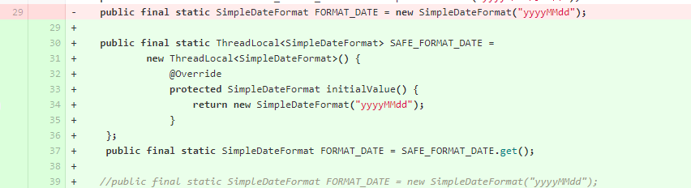

```java
    // ThreadLocal类中的方法
    protected T initialValue() {
        return null;
    }
```

ThreadLocal内存泄露的根源，由于ThreadLocalMap的生命周期跟Thread一样长，如果没有手动删除对应的key，就会导致内存泄露，而不是因为弱引用
ThreadLocal正确的使用方法：<br>
（1）每次使用完ThreadLocal都手动调用remove()方法清除数据；<br>
（2）将ThreadLocal变量定义成private static，这样就一直存在ThreadLocal强引用，也就能保证任何时候都能通过ThreadLocal的弱引用访问到Entry中的value，进而清除掉<br>

#### 32，HTTP消息结构

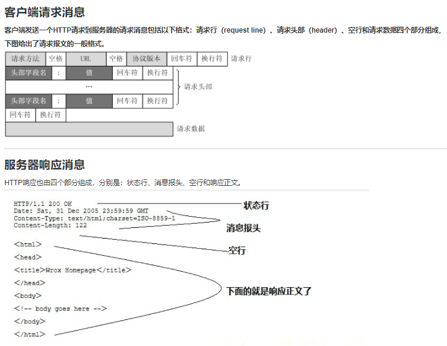

#### 33，部分linux命令

（1）ping命令使用的是什么协议？ ICMP<br>
（2）kill与kill -9的区别，kill命令的底层是什么？<br>
（3）查询端口的命令是什么？ netstat<br>

#### 34，TCP相关

（1）TCP释放连接，哪一方处理time_await状态？<br>

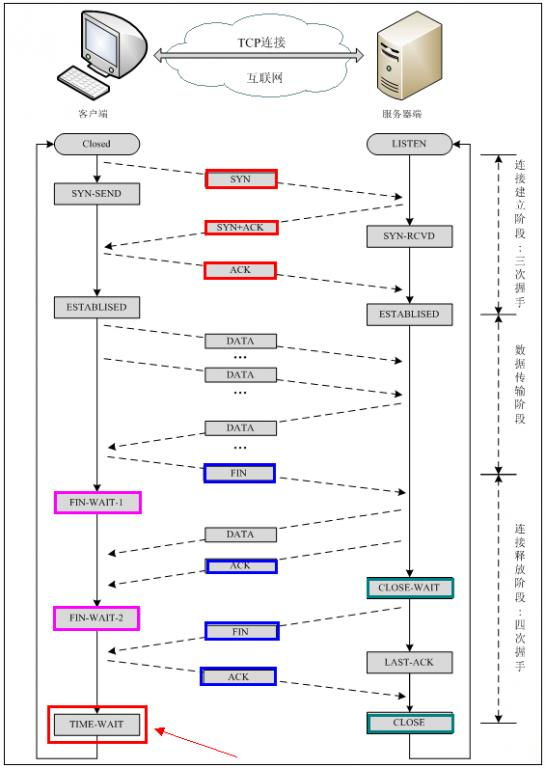

（2）TCP拥塞机制<br>
（3）TCP为什么有粘包和拆包<br>

#### 35，进程间的通信

请看这篇博客：https://www.jianshu.com/p/c1015f5ffa74

#### 36，并发模型

（1）共享内存<br>
比如Java的加锁<br>
（2）消息传递<br>
比如go channel<br>
对线程间共享状态的各种操作都被封装在线程之间传递的消息中，这通常要求：发送消息时对状态进行复制，并且在消息传递的边界上交出这个状态的所有权。从逻辑上看，这个操作与共享内存系统中执行的原子更新操作相同，
但从物理上来看则非常不同。由于需要执行复制操作，所以大多数消息传递的实现在性能上并不优越，但线程中的状态管理工作通常会变得更为简单。

#### 37，服务的熔断与降级

https://www.jianshu.com/p/98e8cfbf1b12

（1）限流<br>
限流是从用户访问压力的角度来考虑如何应对系统故障。<br>
限流为了对服务端的接口接受请求的频率进行限制，防止服务挂掉。比如某一接口的请求限制为 100 个每秒, 对超过限制的请求放弃处理或者放到队列中等待处理。限流可以有效应对突发请求过多。相关阅读：限流算法有哪些？<br>
（2）降级<br>
服务降级：作用在消费者<br>
所谓降级，就是一般是从整体符合考虑，就是当某个服务熔断之后，服务器将不再被调用，此刻客户端可以自己准备一个本地的fallback回调，返回一个缺省值，这样做，虽然服务水平下降，但好歹可用，比直接挂掉要强。<br>
(3)熔断<br>
服务熔断（防止服务雪崩）:作用在服务提供者<br>
当链路的某个微服务不可用或者响应时间太长时，会进行服务的降级，进而熔断该节点微服务的调用，快速返回“错误”的响应信息。当检测到该节点微服务响应正常后恢复调用链

#### 38，dubbo的服务是怎么暴露的？

#### 39，垃圾回收器CMS，G1的区别

#### 40，mysql的事务是怎么实现的？

https://www.cnblogs.com/ffdsj/p/12266539.html

（1）原子性使用 undo log ，从而达到回滚；<br>
（2）持久性：用 redo log，从而达到故障后恢复；<br>
（3）隔离性使用锁以及MVCC,运用的优化思想有读写分离，读读并行，读写并行；<br>
（4）一致性：通过回滚，以及恢复，和在并发环境下的隔离做到一致性。<br>

#### 41，HashMap的put方法

```java
final V putVal(int hash, K key, V value, boolean onlyIfAbsent,
                   boolean evict) {
    Node<K,V>[] tab; Node<K,V> p; int n, i;
    // table未初始化或者长度为0，进行扩容
    if ((tab = table) == null || (n = tab.length) == 0)
        n = (tab = resize()).length;
    /** 
    (n - 1) & hash 确定元素存放在哪个桶中，桶为空，新生成结点放入桶中(此时，这个结点是放在数组中)
    哈希值赋值给i，tab[i]赋值给p，即 p = tab[i = (n - 1) & hash]，虽然是在if分支里，但p变量在方法内第一行，所以能在后续else中使用
    相当于在if之前赋值，if和else都能使用此赋值
    p = tab[i = (n - 1) & hash];
    if (p == null)
        tab[i] = newNode(hash, key, value, null);
    else {
        ......
    }
    */
    if ((p = tab[i = (n - 1) & hash]) == null)
        tab[i] = newNode(hash, key, value, null);
    // 桶中已经存在元素：hash值相同
    else {
        Node<K,V> e; K k;
        // 比较桶中第一个元素(数组中的结点), 如果hash值相等，key相等
        if (p.hash == hash &&
            ((k = p.key) == key || (key != null && key.equals(k))))
                // 将第一个元素赋值给e，用e来记录，后面将e进行旧值覆盖
                e = p;
        // key不相等且为红黑树结点
        else if (p instanceof TreeNode)
            // 放入树中
            e = ((TreeNode<K,V>)p).putTreeVal(this, tab, hash, key, value);
        // 为链表结点
        else {
            // 在链表最末插入结点
            for (int binCount = 0; ; ++binCount) {
                // 到达链表的尾部
                if ((e = p.next) == null) {
                    // 在尾部插入新结点
                    p.next = newNode(hash, key, value, null);
                    // 结点数量达到阈值，转化为红黑树
                    if (binCount >= TREEIFY_THRESHOLD - 1) // -1 for 1st
                        treeifyBin(tab, hash);
                    // 跳出循环
                    break;
                }
                // 判断链表中结点的key值与插入的元素的key值是否相等
                if (e.hash == hash &&
                    ((k = e.key) == key || (key != null && key.equals(k))))
                    // 相等，跳出循环，等待后续操作覆盖旧值
                    break;
                // 用于遍历桶中的链表，与前面的e = p.next组合，可以遍历链表
                p = e;
            }
        }
        // 表示在桶中找到key值、hash值与插入元素相等的结点，进行旧值覆盖
        if (e != null) { 
            // 记录e的value
            V oldValue = e.value;
            // onlyIfAbsent为false或者旧值为null
            if (!onlyIfAbsent || oldValue == null)
                //用新值替换旧值
                e.value = value;
            // 访问后回调
            afterNodeAccess(e);
            // 返回旧值
            return oldValue;
        }
    }
    // 结构性修改
    ++modCount;
    // 实际大小大于阈值则扩容
    if (++size > threshold)
        resize();
    // 插入后回调
    afterNodeInsertion(evict);
    return null;
} 
```

#### 42，Spring启动流程

（1）在创建Spring容器，即启动Spring时：<br>
a. 扫描xml文件，得到所有的BeanDefinition对象，并保存在一个Map中<br>
b. 筛选出非懒加载的单例BeanDefinition进行创建，对于多例不需要在启动过程中创建，会在每次获取Bean时利用BeanDefinition创建<br>
c. 利用BeanDefinition创建Bean就是Bean的创建的生命周期，这过程包括了合并BeanDefinition、推断构造方法、实例化、属性填充、初始化前、初始化、初始化后等步骤，其中AOP就是改重在初始化后这一步骤中<br>
（2）单例Bean创建完成之后，Spring会发布一个容器启动事件<br>
（3）Spring启动结束<br>

#### 43，GC Root对象有哪些

1，虚拟机栈（栈桢中的本地变量表）中引用的对象<br>
2，方法区中类静态属性引用的对象<br>
3，方法区中常量引用的对象<br>
4，本地方法栈中JNI即一般说的Native方法引用的对象<br>

#### 44，Java对象的锁池和等待池

Java平台中，因为有内置锁的机制，每个对象都可以承担锁的功能。Java虚拟机会为每个对象维护两个“队列”（姑且称之为“队列”，尽管它不一定符合数据结构上队列的“先进先出”原则）：<br>
一个叫Entry Set（入口集）;<br>
另外一个叫Wait Set（等待集）。<br>
对于任意的对象objectX，objectX的Entry Set用于存储等待获取objectX这个锁的所有线程，也就是传说中的锁池，objectX的Wait Set用于存储执行了objectX.wait()/wait(long)的线程，也就是等待池。<br>
原文链接：https://blog.csdn.net/qq_22498277/article/details/82184419

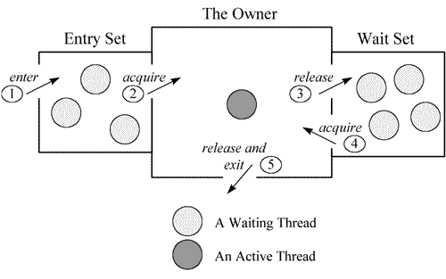

（1）准备争抢会进入临界区的线程会进入Entry Set；<br>
（2）只有一个线程会进去临界区，独占锁；<br>
（3）获取锁的线程执行wait方法会让出锁，并进去Wait Set；<br>
（4）Wait Set中的线程需要被唤醒才能进入Entry Set，然后再参与竞争；<br>

作者：此间有道
链接：https://www.jianshu.com/p/a3f86c89eb54

#### 45，Spring源码阅读

1. Spring的核心类介绍<br>
   1.1  DefaultListableBeanFactory<br>

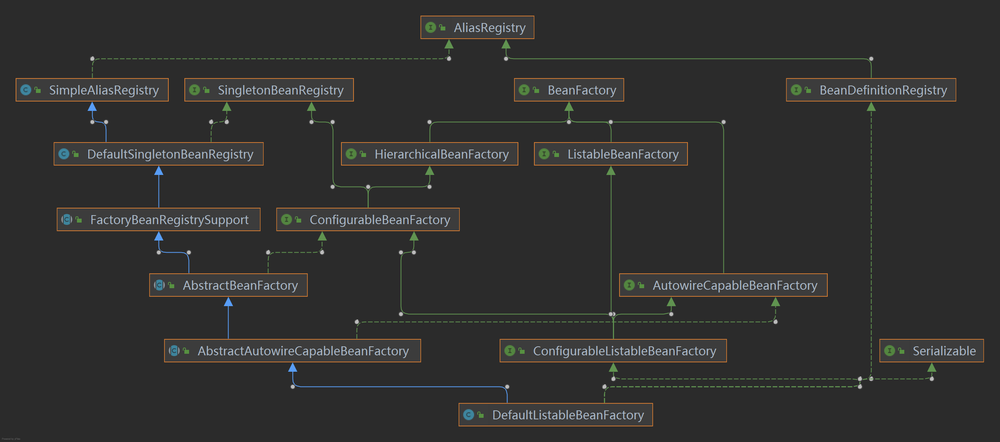

AliasRegistry  定义对alias的简单增删改等操作<br>
SimpleAliasRegistry  主要使用map作为alias的缓存，并对接口AliasRegistry进行实现<br>
SingletonBeanRegistry  定义对单例的注册及获取<br>
BeanFactory  定义获取bean及bean的各种属性<br>
DefaultSingletonBeanRegistry  对接口SingletonBeanRegistry各函数的实现<br>
HierarchicalBeanFactory  继承BeanFactory，也就是在BeanFactory定义的功能的基础上增加了对parentFactory的支持<br>
BeanDefinitionRegistry 定义对BeanDefinition的各种增删改操作<br>
FactoryBeanRegistrySupport  在DefaultSingletonBeanRegistry基础上增加了对FactoryBean的特殊处理功能<br>
ConfigurableBeanFactory  提供配置Factory的各种办法<br>
ListableBeanFactory  根据各种条件获取bean的配置清单<br>
AbstractBeanFactory  综合FactoryBeanRegistrySupport和ConfigurableBeanFactory的功能<br>
AutowireCapableBeanFactory  提供创建bean、自动注入、初始化以及应用bean的后处理器<br>
AbstractAutowireCapableBeanFactory  综合AbstractBeanFactory并对接口AutowireCapableBeanFactory进行实现<br>
ConfigurableListableBeanFactory  BeanFactory配置清单，指定忽略糊弄及接口等<br>
DefaultListableBeanFactory  综合上面所有功能，主要是对bean注册后的处理<br>

1.2  XmlBeanDefinitionReader

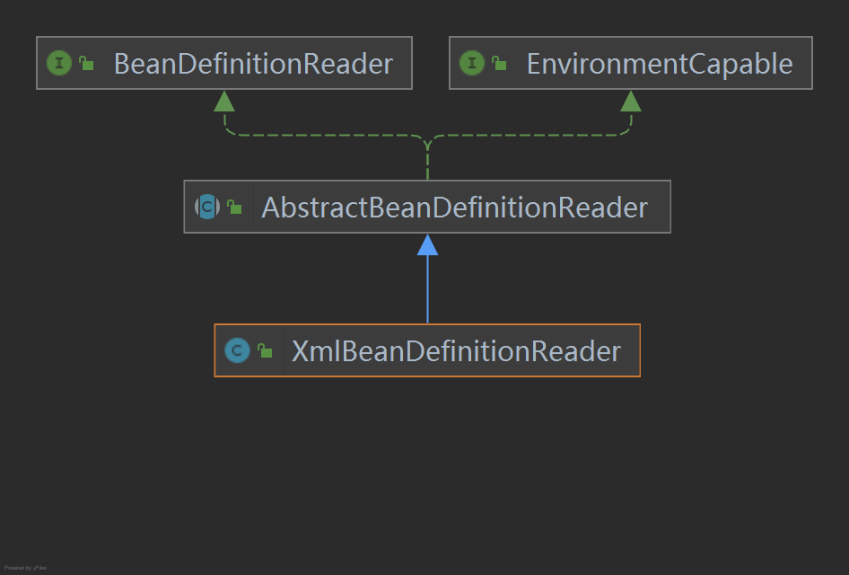

ResourceLoader  定义资源加载器，主要应用于根据给定的资源文件地址返回对应的Resource<br>
BeanDefinitionReader  主要定义资源文件读取并置换为BeanDefinition的各个功能<br>
EnvironmentCapable  定义获取Environment方法<br>
DocumentLoader  定义从资源文件加载到置换为Document的功能<br>
AbstractBeanDefinitionReader  对EnvironmentCapable、BeanDefinitionReader类定义的功能进行实现<br>
BeanDefinitionDocumentReader  定义读取Document并注册BeanDefinition功能<br>
BeanDefinitionParserDelegate  定义解析Element的各种方法<br>

2. 容器的基础XmlBeanFactory

2.1  配置文件的封装

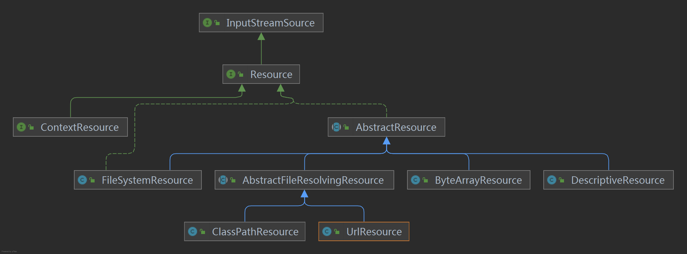

```java
    // AbstractAutowireCapableBeanFactory
    public AbstractAutowireCapableBeanFactory() {
        this.instantiationStrategy = new CglibSubclassingInstantiationStrategy();
        this.parameterNameDiscoverer = new DefaultParameterNameDiscoverer();
        this.allowCircularReferences = true;
        this.allowRawInjectionDespiteWrapping = false;
        this.ignoredDependencyTypes = new HashSet();
        this.ignoredDependencyInterfaces = new HashSet();
        this.currentlyCreatedBean = new NamedThreadLocal("Currently created bean");
        this.factoryBeanInstanceCache = new ConcurrentHashMap();
        this.factoryMethodCandidateCache = new ConcurrentHashMap();
        this.filteredPropertyDescriptorsCache = new ConcurrentHashMap();
        this.ignoreDependencyInterface(BeanNameAware.class);
        this.ignoreDependencyInterface(BeanFactoryAware.class);
        this.ignoreDependencyInterface(BeanClassLoaderAware.class);
    }

    public void ignoreDependencyInterface(Class<?> ifc) {
        this.ignoredDependencyInterfaces.add(ifc);
    }

    protected boolean isExcludedFromDependencyCheck(PropertyDescriptor pd) {
        return AutowireUtils.isExcludedFromDependencyCheck(pd) || this.ignoredDependencyTypes.contains(pd.getPropertyType()) || AutowireUtils.isSetterDefinedInInterface(pd, this.ignoredDependencyInterfaces);
    }
```

ignoreDependencyInterface方法的主要是忽略给定接口的自动装配功能，那么这样做的目的是什么？
举例来说，当A中有属性B，那么当Spring在获取A的Bean的时候如果其属性B还没初始化，那么Spring会自动初始化B。但是，某些情况下，B不会被初始化，其中的一种情况就是B实现了BeanNameAware接口。<br>
Spring中是这样介绍的：自动装配时忽略给定的接口依赖，典型应用是通过其他方式解析Application上下文注册依赖，类似于BeanFactory通过BeanFactoryAware进行注入或者ApplicationContext通过ApplicationContextAware进行注入<br>

2.2  加载Bean

```java
public class XmlBeanFactory extends DefaultListableBeanFactory {
    private final XmlBeanDefinitionReader reader;

    public XmlBeanFactory(Resource resource) throws BeansException {
        this(resource, (BeanFactory)null);
    }

    public XmlBeanFactory(Resource resource, BeanFactory parentBeanFactory) throws BeansException {
        super(parentBeanFactory);
        this.reader = new XmlBeanDefinitionReader(this);
        /** 加载Bean
         * 1，封装资源文件。当进入XmlBeanDefinitionReader后首先对参数Resource使用EncodedResource封装
         * 2，获取输入流。从Resource中获取对应的InputStream并构造InputSource
         * 3，通过构造的InputSource实例和Resource实例继续调用函数doLoadBeanDefinitions.
         * 注意：InputSource这个类并不来自于Spring，它的全路径是org.xml.sax.InputSource
         */
        this.reader.loadBeanDefinitions(resource);
    }
}
```

InputSource，EntityResolver都在jdk中
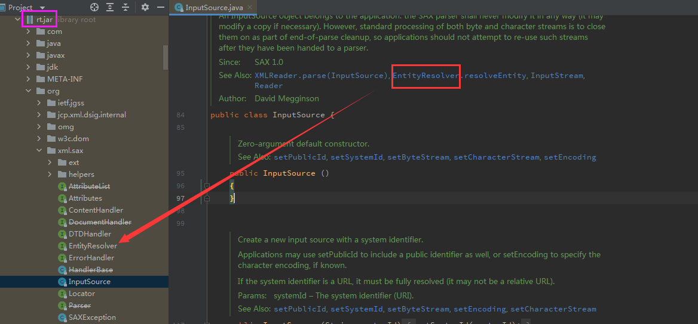

```java
    // XmlBeanDefinitionReader
    protected int doLoadBeanDefinitions(InputSource inputSource, Resource resource)
            throws BeanDefinitionStoreException {

        try {
            // 1，获取对XML文件的验证模式
            // 2，加载XML文件，并得到对应的Document
            Document doc = doLoadDocument(inputSource, resource);
            // 3，根据返回的Document注册Bean信息
            int count = registerBeanDefinitions(doc, resource);
            if (logger.isDebugEnabled()) {
                logger.debug("Loaded " + count + " bean definitions from " + resource);
            }
            return count;
        }
        catch (BeanDefinitionStoreException ex) {
            throw ex;
        }
        catch (SAXParseException ex) {
            throw new XmlBeanDefinitionStoreException(resource.getDescription(),
                    "Line " + ex.getLineNumber() + " in XML document from " + resource + " is invalid", ex);
        }
        catch (SAXException ex) {
            throw new XmlBeanDefinitionStoreException(resource.getDescription(),
                    "XML document from " + resource + " is invalid", ex);
        }
        catch (ParserConfigurationException ex) {
            throw new BeanDefinitionStoreException(resource.getDescription(),
                    "Parser configuration exception parsing XML from " + resource, ex);
        }
        catch (IOException ex) {
            throw new BeanDefinitionStoreException(resource.getDescription(),
                    "IOException parsing XML document from " + resource, ex);
        }
        catch (Throwable ex) {
            throw new BeanDefinitionStoreException(resource.getDescription(),
                    "Unexpected exception parsing XML document from " + resource, ex);
        }
    }

    /**
     * Actually load the specified document using the configured DocumentLoader.
     * @param inputSource the SAX InputSource to read from
     * @param resource the resource descriptor for the XML file
     * @return the DOM Document
     * @throws Exception when thrown from the DocumentLoader
     * @see #setDocumentLoader
     * @see DocumentLoader#loadDocument
     */
    protected Document doLoadDocument(InputSource inputSource, Resource resource) throws Exception {
        return this.documentLoader.loadDocument(inputSource, getEntityResolver(), this.errorHandler,
                getValidationModeForResource(resource), isNamespaceAware());
    }
```

```java
    // XmlValidationModeDetector
    public int detectValidationMode(InputStream inputStream) throws IOException {
        // Peek into the file to look for DOCTYPE.
        BufferedReader reader = new BufferedReader(new InputStreamReader(inputStream));
        try {
            boolean isDtdValidated = false;
            String content;
            while ((content = reader.readLine()) != null) {
                content = consumeCommentTokens(content);
                if (this.inComment || !StringUtils.hasText(content)) {
                    continue;
                }
                // Spring用来检测验证模式的办法就是判断是否包含DOCTYPE，如果包含就是DTD，否则就是XSD
                if (hasDoctype(content)) {
                    isDtdValidated = true;
                    break;
                }
                if (hasOpeningTag(content)) {
                    // End of meaningful data...
                    break;
                }
            }
            return (isDtdValidated ? VALIDATION_DTD : VALIDATION_XSD);
        }
        catch (CharConversionException ex) {
            // Choked on some character encoding...
            // Leave the decision up to the caller.
            return VALIDATION_AUTO;
        }
        finally {
            reader.close();
        }
    }
```

#### 46，并发的三大特性<br>

（1）原子性<br>
java内存模型保证原子性：lock, unlock, synchronized<br>
（2）可见性<br>
a. volatile<br>
Java内存模型是通过在变量修改后将新值同步回主内存，在变量读取前从主内存刷新变量值这种依赖主内存作为传递媒介的方式来实现可见性的，无论是普通变量还是volatile变量都是如此。<br>
普通变量与volatie变量的区别是，volatile的特殊规则保证了新值能立即同步到主内存，以及每次使用前立即从主内存刷新。因此我们可以说volatile保证了多线程操作时变量的可见性，而普通变量则不能保证这一点。<br>
b. synchronized<br>
同步块的可见性，是由“对一个变量执行unlock操作之前，必须先把此变量同步回主内存中（执行store、write操作）”这条规则获得的。<br>
c. final<br>
被final修饰的字段在构造器中一旦被初始化完成，并且构造器没有把“this”的引用传递出去，那么在其他线程中就能看见final字段的值<br>
（3）有序性<br>
a. volatile<br>
volatile关键字本身就包含了禁止指令重排序的语义<br>
b. synchronized<br>
则是由“一个变量在同一个时刻只允许一条线程对其进行lock操作”这条规则获得的，这个规则决定了持有同一个锁的两个同步块只能串行地进入<br>

#### 47，java对象的二分模型

otSpot采用Oop-Klass模型来表示Java对象，其中Klass对应着Java对象的类型（Class），而Oop则对应着Java对象的实例（Instance）。

```
// hotspot/src/share/vm/interpreter/interpreterRuntime.cpp
JRT_ENTRY(void, InterpreterRuntime::_new(JavaThread* current, ConstantPool* pool, int index))
  Klass* k = pool->klass_at(index, CHECK);
  InstanceKlass* klass = InstanceKlass::cast(k);

  // Make sure we are not instantiating an abstract klass
  klass->check_valid_for_instantiation(true, CHECK);

  // Make sure klass is initialized
  klass->initialize(CHECK);

  // At this point the class may not be fully initialized
  // because of recursive initialization. If it is fully
  // initialized & has_finalized is not set, we rewrite
  // it into its fast version (Note: no locking is needed
  // here since this is an atomic byte write and can be
  // done more than once).
  //
  // Note: In case of classes with has_finalized we don't
  //       rewrite since that saves us an extra check in
  //       the fast version which then would call the
  //       slow version anyway (and do a call back into
  //       Java).
  //       If we have a breakpoint, then we don't rewrite
  //       because the _breakpoint bytecode would be lost.
  oop obj = klass->allocate_instance(CHECK);
  current->set_vm_result(obj);
JRT_END
```

oop(Ordinary Object Pointer) 继承体系：

```
typedef class oopDesc*                    oop;
typedef class   instanceOopDesc*            instanceOop;
typedef class   arrayOopDesc*               arrayOop;
typedef class     objArrayOopDesc*            objArrayOop;
typedef class     typeArrayOopDesc*           typeArrayOop;
```

oopDesc类，对象头包括markword和元类型指针

```
class oopDesc {
  friend class VMStructs;
  friend class JVMCIVMStructs;
 private:
  volatile markWord _mark;
  union _metadata {
    Klass*      _klass;
    narrowKlass _compressed_klass;
  } _metadata;
  // ......
}
```

klass类

```
class Klass : public Metadata {
  friend class VMStructs;
  friend class JVMCIVMStructs;
 protected:
  // If you add a new field that points to any metaspace object, you
  // must add this field to Klass::metaspace_pointers_do().

  // note: put frequently-used fields together at start of klass structure
  // for better cache behavior (may not make much of a difference but sure won't hurt)
  enum { _primary_super_limit = 8 };

  // The "layout helper" is a combined descriptor of object layout.
  // For klasses which are neither instance nor array, the value is zero.
  //
  // For instances, layout helper is a positive number, the instance size.
  // This size is already passed through align_object_size and scaled to bytes.
  // The low order bit is set if instances of this class cannot be
  // allocated using the fastpath.
  //
  // For arrays, layout helper is a negative number, containing four
  // distinct bytes, as follows:
  //    MSB:[tag, hsz, ebt, log2(esz)]:LSB
  // where:
  //    tag is 0x80 if the elements are oops, 0xC0 if non-oops
  //    hsz is array header size in bytes (i.e., offset of first element)
  //    ebt is the BasicType of the elements
  //    esz is the element size in bytes
  // This packed word is arranged so as to be quickly unpacked by the
  // various fast paths that use the various subfields.
  //
  // The esz bits can be used directly by a SLL instruction, without masking.
  //
  // Note that the array-kind tag looks like 0x00 for instance klasses,
  // since their length in bytes is always less than 24Mb.
  //
  // Final note:  This comes first, immediately after C++ vtable,
  // because it is frequently queried.
  jint        _layout_helper;

  // Klass identifier used to implement devirtualized oop closure dispatching.
  const KlassID _id;

  // Processed access flags, for use by Class.getModifiers.
  jint        _modifier_flags;

  // The fields _super_check_offset, _secondary_super_cache, _secondary_supers
  // and _primary_supers all help make fast subtype checks.  See big discussion
  // in doc/server_compiler/checktype.txt
  //
  // Where to look to observe a supertype (it is &_secondary_super_cache for
  // secondary supers, else is &_primary_supers[depth()].
  juint       _super_check_offset;

  // Class name.  Instance classes: java/lang/String, etc.  Array classes: [I,
  // [Ljava/lang/String;, etc.  Set to zero for all other kinds of classes.
  Symbol*     _name;

  // Cache of last observed secondary supertype
  Klass*      _secondary_super_cache;
  // Array of all secondary supertypes
  Array<Klass*>* _secondary_supers;
  // Ordered list of all primary supertypes
  Klass*      _primary_supers[_primary_super_limit];
  // java/lang/Class instance mirroring this class
  OopHandle   _java_mirror;
  // Superclass
  Klass*      _super;
  // First subclass (NULL if none); _subklass->next_sibling() is next one
  Klass* volatile _subklass;
  // Sibling link (or NULL); links all subklasses of a klass
  Klass* volatile _next_sibling;

  // All klasses loaded by a class loader are chained through these links
  Klass*      _next_link;

  // The VM's representation of the ClassLoader used to load this class.
  // Provide access the corresponding instance java.lang.ClassLoader.
  ClassLoaderData* _class_loader_data;

  int _vtable_len;              // vtable length. This field may be read very often when we
                                // have lots of itable dispatches (e.g., lambdas and streams).
                                // Keep it away from the beginning of a Klass to avoid cacheline
                                // contention that may happen when a nearby object is modified.
  AccessFlags _access_flags;    // Access flags. The class/interface distinction is stored here.

  // ...
}
```

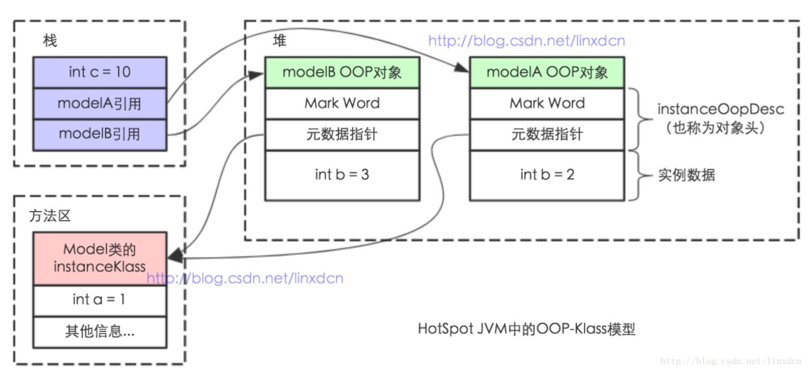

HotSpot是基于c++实现，而c++是一门面向对象的语言，本身具备面向对象基本特征，所以Java中的对象表示，最简单的做法是为每个Java类生成一个c++类与之对应。

但HotSpot JVM并没有这么做，而是设计了一个OOP-Klass Model。这里的 OOP 指的是 Ordinary Object Pointer （普通对象指针），它用来表示对象的实例信息，看起来像个指针实际上是藏在指针里的对象。而 Klass 则包含元数据和方法信息，用来描述Java类。

之所以采用这个模型是因为HotSopt JVM的设计者不想让每个对象中都含有一个vtable（虚函数表），所以就把对象模型拆成klass和oop，其中oop中不含有任何虚函数，而Klass就含有虚函数表，可以进行method dispatch。

链接：https://www.jianshu.com/p/424a920771a3

#### 48，Spring事务怎么实现回滚

（1）Spring的事务管理是如何实现的<br>
总述：Spring事务是由AOP实现的，首先要生成具体的代码对象，然后按照AOP的整套流程来执行具体的操作逻辑，正常情况下要通过通知来完成核心功能，但是事务不是通过通知来实现的，而是通过TransactionInterceptorjg来实现的，通过调用invoke方法来实现具体的逻辑<br>
分述：a. 先做准备工作，解析各个方法上事务相关的属性，根据具体的属性来判断是否开启新事务<br>
    b. 当需要开启的时候，获取数据库连接，关闭自动提交功能，开启事务<br>
    c. 执行具体的sql逻辑操作<br>
    d. 在操作过程中，如果执行失败了，那么会通过completeTransactionAfterThrowing方法回滚，回滚的逻辑是通过doRollBack方法来实现，也是先获取数据库连接对象，通过连接对象回滚<br>
e. 回滚之后，要清除相关的事务信息：cleanupTransactionInfo
f. 如果没有发生异常，则执行commitTransactionAfterReturning方法，完成事务的提交，提交的逻辑是通过doCommit来实现：先获取数据库连接对象，通过连接对象提交

（2）源码
a. TransactionInterceptor类

```java
public class TransactionInterceptor extends TransactionAspectSupport implements MethodInterceptor, Serializable {

    // ...

    @Override
    public Object invoke(final MethodInvocation invocation) throws Throwable {
        // Work out the target class: may be {@code null}.
        // The TransactionAttributeSource should be passed the target class
        // as well as the method, which may be from an interface.
        Class<?> targetClass = (invocation.getThis() != null ? AopUtils.getTargetClass(invocation.getThis()) : null);

        // Adapt to TransactionAspectSupport's invokeWithinTransaction...
        return invokeWithinTransaction(invocation.getMethod(), targetClass, new InvocationCallback() {
            @Override
            public Object proceedWithInvocation() throws Throwable {
                return invocation.proceed();
            }
        });
    }

    // ...
}
```

b. 查看invokeWithinTransaction方法的实现，在TransactionAspectSupport类中

```java
// TransactionAspectSupport类
protected Object invokeWithinTransaction(Method method, Class<?> targetClass, final InvocationCallback invocation)
        throws Throwable {

    // If the transaction attribute is null, the method is non-transactional.
    final TransactionAttribute txAttr = getTransactionAttributeSource().getTransactionAttribute(method, targetClass);
    final PlatformTransactionManager tm = determineTransactionManager(txAttr);
    final String joinpointIdentification = methodIdentification(method, targetClass, txAttr);

    if (txAttr == null || !(tm instanceof CallbackPreferringPlatformTransactionManager)) {
        // Standard transaction demarcation with getTransaction and commit/rollback calls.
        TransactionInfo txInfo = createTransactionIfNecessary(tm, txAttr, joinpointIdentification);
        Object retVal = null;
        try {
            // This is an around advice: Invoke the next interceptor in the chain.
            // This will normally result in a target object being invoked.
            retVal = invocation.proceedWithInvocation();
        }
        catch (Throwable ex) {
            // target invocation exception
            completeTransactionAfterThrowing(txInfo, ex);
            throw ex;
        }
        finally {
            // 清除
            cleanupTransactionInfo(txInfo);
        }
        // 提交事务
        commitTransactionAfterReturning(txInfo);
        return retVal;
    }

// ...    
}


protected void commitTransactionAfterReturning(TransactionInfo txInfo) {
    if (txInfo != null && txInfo.hasTransaction()) {
        if (logger.isTraceEnabled()) {
            logger.trace("Completing transaction for [" + txInfo.getJoinpointIdentification() + "]");
        }
        txInfo.getTransactionManager().commit(txInfo.getTransactionStatus());
    }
}

/**
 * Handle a throwable, completing the transaction.
 * We may commit or roll back, depending on the configuration.
 * @param txInfo information about the current transaction
 * @param ex throwable encountered
 */
protected void completeTransactionAfterThrowing(TransactionInfo txInfo, Throwable ex) {
    if (txInfo != null && txInfo.hasTransaction()) {
        if (logger.isTraceEnabled()) {
            logger.trace("Completing transaction for [" + txInfo.getJoinpointIdentification() +
        "] after exception: " + ex);
        }
        if (txInfo.transactionAttribute.rollbackOn(ex)) {
            try {
                txInfo.getTransactionManager().rollback(txInfo.getTransactionStatus());
            }
            catch (TransactionSystemException ex2) {
                logger.error("Application exception overridden by rollback exception", ex);
                ex2.initApplicationException(ex);
                throw ex2;
            }
            catch (RuntimeException ex2) {
                logger.error("Application exception overridden by rollback exception", ex);
                throw ex2;
            }
            catch (Error err) {
                logger.error("Application exception overridden by rollback error", ex);
                throw err;
            }
        }

        ...
```

c. 提交或回滚，是txInfo.getTransactionManager()之后执行commit()或rollback()
查看commit方法或rollback方法，进入到PlatformTransactionManager接口，进一步查看，来到AbstractPlatformTransactionManager类

```java
// AbstractPlatformTransactionManager.java
    @Override
    public final void commit(TransactionStatus status) throws TransactionException {
        if (status.isCompleted()) {
            throw new IllegalTransactionStateException(
                    "Transaction is already completed - do not call commit or rollback more than once per transaction");
        }

        DefaultTransactionStatus defStatus = (DefaultTransactionStatus) status;
        if (defStatus.isLocalRollbackOnly()) {
            if (defStatus.isDebug()) {
                logger.debug("Transactional code has requested rollback");
            }
            processRollback(defStatus);
            return;
        }
        if (!shouldCommitOnGlobalRollbackOnly() && defStatus.isGlobalRollbackOnly()) {
            if (defStatus.isDebug()) {
                logger.debug("Global transaction is marked as rollback-only but transactional code requested commit");
            }
            processRollback(defStatus);
            // Throw UnexpectedRollbackException only at outermost transaction boundary
            // or if explicitly asked to.
            if (status.isNewTransaction() || isFailEarlyOnGlobalRollbackOnly()) {
                throw new UnexpectedRollbackException(
                        "Transaction rolled back because it has been marked as rollback-only");
            }
            return;
        }

        processCommit(defStatus);
    }
```

d. 查看processCommit方法的doCommit方法，来到DataSourceTransactionManager类

```java
protected void doCommit(DefaultTransactionStatus status) {
    DataSourceTransactionObject txObject = (DataSourceTransactionObject) status.getTransaction();
    Connection con = txObject.getConnectionHolder().getConnection();
    if (status.isDebug()) {
        logger.debug("Committing JDBC transaction on Connection [" + con + "]");
    }
    try {
        con.commit();
    }
    catch (SQLException ex) {
        throw new TransactionSystemException("Could not commit JDBC transaction", ex);
    }
}
```

e. 关闭自动提交，是在哪里设置的？
mybatis框架中的DefaultSqlSessionFactory的openSession()方法默认是关闭自动提交

```java
public class DefaultSqlSessionFactory implements SqlSessionFactory {

  private final Configuration configuration;

  public DefaultSqlSessionFactory(Configuration configuration) {
    this.configuration = configuration;
  }

  public SqlSession openSession() {
    return openSessionFromDataSource(configuration.getDefaultExecutorType(), null, false);
  }
    ...
```

DataSourceTransactionManager类的doBegin方法：

```java
@Override
protected void doBegin(Object transaction, TransactionDefinition definition) {
    DataSourceTransactionObject txObject = (DataSourceTransactionObject) transaction;
    Connection con = null;

    try{
        if(!txObject.hasConnectionHolder()||
        txObject.getConnectionHolder().isSynchronizedWithTransaction()){
        Connection newCon=this.dataSource.getConnection();
        if(logger.isDebugEnabled()){
        logger.debug("Acquired Connection ["+newCon+"] for JDBC transaction");
        }
        txObject.setConnectionHolder(new ConnectionHolder(newCon),true);
        }

        txObject.getConnectionHolder().setSynchronizedWithTransaction(true);
        con=txObject.getConnectionHolder().getConnection();

        Integer previousIsolationLevel=DataSourceUtils.prepareConnectionForTransaction(con,definition);
        txObject.setPreviousIsolationLevel(previousIsolationLevel);

        // Switch to manual commit if necessary. This is very expensive in some JDBC drivers,
        // so we don't want to do it unnecessarily (for example if we've explicitly
        // configured the connection pool to set it already).
        if(con.getAutoCommit()){
        txObject.setMustRestoreAutoCommit(true);
        if(logger.isDebugEnabled()){
        logger.debug("Switching JDBC Connection ["+con+"] to manual commit");
        }
        // 设置自动提交为关闭
        con.setAutoCommit(false);
        }

        ...
    }
```

#### 49，isAssignableFrom()方法

```java
父类.class.isAssignableFrom(子类.class)

子类实例 instanceof 父类类型
```

#### 50，mysql的回表查询

（1）主键索引和普通索引的查询区别<br>
摘自b站：bobby的技术笔记
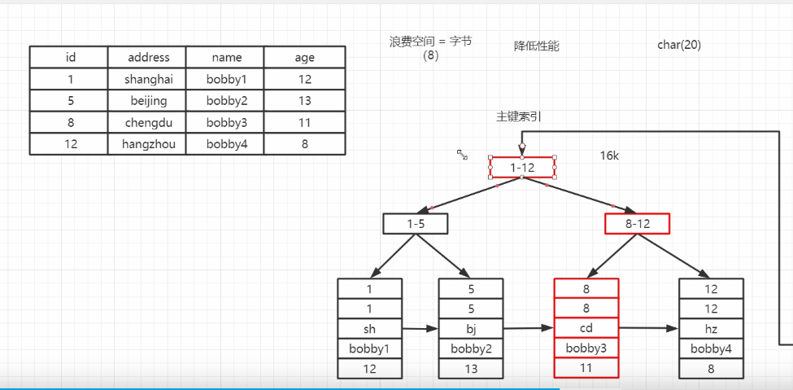
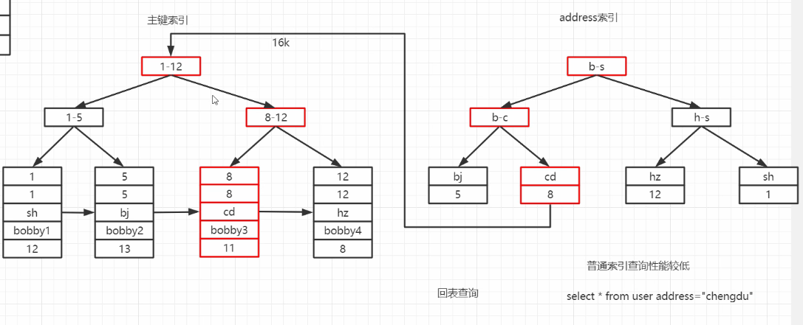

（2）Multi-Range Read（多范围读）<br>
a. 将查询得到的辅助索引键值存放于一个缓存中，这时缓存中的数据是根据辅助索引键值排序的<br>
b. 将缓存中的键值根据RowID进行排序<br>
c. 根据RowID的排序顺序来访问实际的数据文件<br>
若启用Multi-Range Read特性，在执行计划的列Extra除了看到Using index condition外，还会看见Using MRR选项<br>
（3）Index Condition Pushdown（ICP，索引下推）<br>
查看ICP设置的sql语句：select @@optimizer_switch;
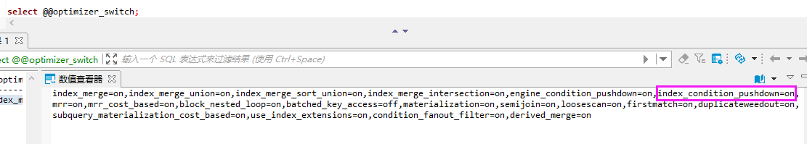
适合于联合索引<br>
参考：<br>
https://www.cnblogs.com/xujunkai/p/12622758.html<br>
https://www.zhangshengrong.com/p/7B1LqVWDaw/

（4）索引失效<br>
参考：https://www.modb.pro/db/89169

#### 51，OLAP和OLTP

（1）OLAP  联机分析处理  数据仓库  hive                     对历史数据进行分析，产生决策性的影响<br>
（2）OLTP  联机事务处理  数据库    mysql/oracle/db2/...    支撑业务系统，在很短时间内产生结果

#### 52，mysql内部的XA事务

* 在mysql数据库中还存在另外一种分布式事务，其在存储引擎与插件之间，又或者在存储引擎与存储引擎之间，称之炎内部XA事务
* 最为常见的内部XA事务存在于binlog与InnoDB存储引擎之间：mysql redo log的二阶段提交<br>
  参考：https://www.cnblogs.com/kiwi-deng/p/13641783.html
  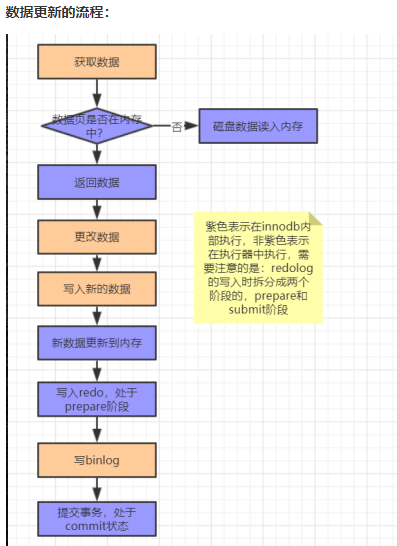

#### 53，事务的2PC与3PC的区别

* XA 是指由 X/Open 组织提出的分布式事务处理的规范.
* XA 规范主要定义了事务管理器(Transaction Manager)和局部资源管理器(Local Resource Manager)之间的接口。
* XA分布式协议包含二阶段提交和三阶段提交两种协议实现。<br>
  **2PC**：Two-Phase Commit<br>
  **3PC**：Three-Phase Commit<br>
  参考：https://baijiahao.baidu.com/s?id=1693824822611080380&wfr=spider&for=pc

（1）3PC比2PC多了一个can commit阶段，减少了不必要的资源浪费，因为2PC第一阶段会占用资源，而3PC的can commit阶段只校验sql，不占用资源，如果不能执行，直接返回，减少了资源占用<br>
（2）引入超时机制，同时在协调者和参与者中都引入超时机制<br>
2PC只有协调者有超时机制，超时后，发送回滚指令<br>
3PC 协调者和参与者都有超时机制

#### 54，TCC与XA的区别

（1）XA是资源层面的分布式事务，强一致性，在两阶段提交的整个过程中，一直会持有资源的锁。<br>

* XA事务中的两阶段提交内部过程是对开发者屏蔽的，回顾我们之前讲解JTA规范时，通过UserTransaction的commit方法来提交全局事务，这只是一次方法调用，其内部会委派给TransactionManager进行真正的两阶段提交，因此开发者从代码层面是感知不到这个过程的。
* 事务管理器在两阶段提交过程中，从prepare到commit/rollback过程中，资源实际上一直都是被加锁的。如果有其他人需要更新这两条记录，那么就必须等待锁释放。

（2）TCC是业务层面的分布式事务，最终一致性，不会一直持有资源的锁。

* TCC，Try-Confirm-Cancel   将一次事务操作分为三个阶段： 
  **Try**：这个阶段对各个服务的资源做检测以及对资源进行锁定或者预留；<br>
  **Confirm** ：执行真正的业务操作，不作任何业务检查，只使用Try阶段预留的业务资源，Confirm操作要求具备幂等设计，Confirm失败后需要进行重试；<br>
  **Cancel**：如果任何一个服务的业务方法执行出错，那么这里就需要进行补偿，即执行回滚操作，释放Try阶段预留的业务资源 ，Cancel操作要求具备幂等设计，Cancel失败后需要进行重试

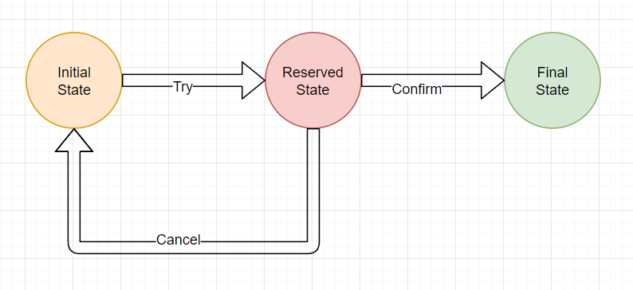

* TCC中的两阶段提交并没有对开发者完全屏蔽，也就是说从代码层面，开发者是可以感受到两阶段提交的存在。如上述航班预定案例：在第一阶段，航空公司需要提供try接口(机票资源预留)。在第二阶段，航空公司提需要提供confirm/cancel接口(确认购买机票/取消预留)。开发者明显的感知到了两阶段提交过程的存在。
* try、confirm/cancel在执行过程中，一般都会开启各自的本地事务，来保证方法内部业务逻辑的ACID特性。
  1. try过程的本地事务，是保证资源预留的业务逻辑的正确性。
  2. confirm/cancel执行的本地事务逻辑确认/取消预留资源，以保证最终一致性，也就是所谓的补偿型事务(Compensation-Based Transactions)。
  3. 由于是多个独立的本地事务，因此不会对资源一直加锁。

另外，这里提到confirm/cancel执行的本地事务是补偿性事务<br>

参考：http://www.tianshouzhi.com/api/tutorials/distributed_transaction/388

#### 55，可靠消息服务方案，最大努力通知方案

#### 56，缓存的穿透，击穿，雪崩

（1）穿透：缓存中不存在，数据库中不存在，高并发，少量key<br>
（2）击穿：缓存中不存在，数据库中存在，高并发，少量key过期<br>
（3）雪崩：缓存中不存在，数据库中存在，高并发，大量key在同一时间过期<br>

#### 57，SpringMVC的九大组件

* 上传解析器
* 国际化解析器
* 主题解析器
* handlerMapping
* handlerAdapter
* handlerException解析器
* requestToViewName解析器
* 视图解析器
* FlashMap解析器：flashMap主要用在redirect中传递参数

#### 58，redis主从复制

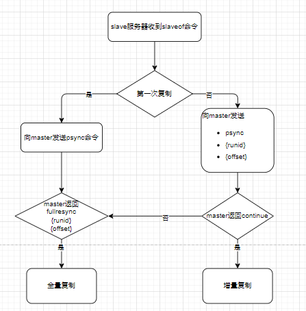

#### 59，springboot自动装配

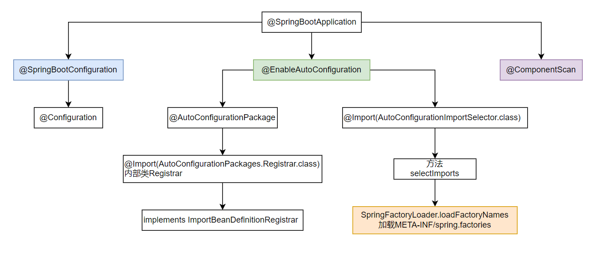

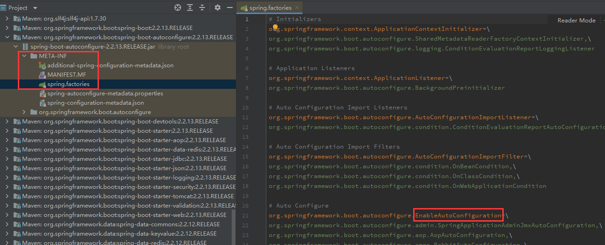

#### 60，MySQL各版本，对于add Index的处理方式是不同的，主要有三种：

（1）Copy Table方式

* 这是InnoDB最早支持的创建索引的方式。顾名思义，创建索引是通过临时表拷贝的方式实现的。
* 新建一个带有新索引的临时表，将原表数据全部拷贝到临时表，然后Rename，完成创建索引的操作。
* 这个方式创建索引，创建过程中，原表是可读的。但是会消耗一倍的存储空间。

（2）Inplace方式

* 这是原生MySQL 5.5，以及innodb_plugin中提供的创建索引的方式。所谓Inplace，也就是索引创建在原表上直接进行，不会拷贝临时表。相对于Copy Table方式，这是一个进步。
* Inplace方式创建索引，创建过程中，原表同样可读的，但是不可写。

（3）Online方式

* 这是MySQL 5.6.7中提供的创建索引的方式。无论是Copy Table方式，还是Inplace方式，创建索引的过程中，原表只能允许读取，不可写。对应用有较大的限制，因此MySQL最新版本中，InnoDB支持了所谓的Online方式创建索引。

* InnoDB的Online Add Index，首先是Inplace方式创建索引，无需使用临时表。在遍历聚簇索引，收集记录并插入到新索引的过程中，原表记录可修改。而修改的记录保存在Row Log中。当聚簇索引遍历完毕，并全部插入到新索引之后，重放Row Log中的记录修改，使得新索引与聚簇索引记录达到一致状态

摘自博客：https://www.jb51.net/article/75217.htm

#### 61，RabbitMQ如何确保消息发送？消息接收？

（1）信道需要设置为confirm模式，则所有在信道上发布的消息都会分配一个唯一ID。
一旦消息被投递到queue（可持久化的消息需要定稿磁盘），信道会发送一个确诊给生产者（包含消息唯一ID），如果RabbitMQ发生内部错误从而导致消息丢失，会发送一条nack（未确诊）消息给生产者。
在channel 被设置成Confirm模式之后，所有被publish的后续消息都将被Confirm（即 ack）或者被nack一次。但是没有对消息被Confirm的快慢做任何保证，并且同一条消息不会既被Confirm又被nack。
（2）消费者(Consumer)的Confirm模式
为了保证消息从队列可靠地到达消费者，RabbitMQ提供消息确认机制(message acknowledgment)。消费者在声明队列时，可以指定noAck参数，当noAck=false时，RabbitMQ会等待消费者显式发回ack信号后才从内存(和磁盘，如果是持久化消息的话)中移去消息。否则，RabbitMQ会在队列中消息被消费后立即删除它。
采用消息确认机制后，只要令noAck=false，消费者就有足够的时间处理消息(任务)，不用担心处理消息过程中消费者进程挂掉后消息丢失的问题，因为RabbitMQ会一直持有消息直到消费者显式调用basicAck为止。
在Consumer中Confirm模式中分为手动确认和自动确认。
